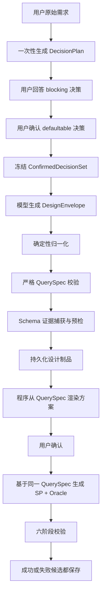

# QuerySpec-first 方案生成与校验流水线根治计划

日期：2026-07-24

## 1. 背景与结论

会话 18 的直接错误是：

```text
校验规则引用未声明输出: CardCode, DocDate, DocTotalSys
```

具体表现为：

- `outputs.name` 使用了面向调用方的业务输出名或别名。
- `verification_rules.required_columns` 使用了数据库物理字段名。
- 严格契约要求 `required_columns` 必须属于 `outputs.name`，因此拒绝。
- 通用模型修复一次后仍未解决。
- 原始方案没有展示，用户只看到“方案生成失败”。

但这只是一个表面症状。当前完整流程包含多次模型重新解释：


每次重新解释都可能改变：

- 业务口径
- 字段命名
- 输出别名
- 过滤条件
- 校验列
- Schema 对象

会话 18 还出现了另一条漂移证据：

- 用户在 Q5 选择“排除已取消发票”。
- 关键项阶段又生成“返回所有状态并增加取消标志”。
- 后一阶段覆盖或冲突了前一阶段已经确认的事实。

因此，根因排序为：

1. **流程缺少唯一事实源**：每个阶段都重新生成上一个阶段的内容。
2. **Harness 职责不完整**：能发现冲突，但缺少安全的确定性归一化、错误分类和草稿保留。
3. **模型输出不稳定**：是触发器，不应成为系统正确性的前提。
4. **校验失败策略过于粗糙**：正确地拒绝了冲突，却把可诊断、可编辑的草稿隐藏了。

本计划采用 QuerySpec-first 架构，不通过增加模型重试次数掩盖问题。

## 2. 目标

### 2.1 用户体验目标

- 已确认的业务决策不会被后续关键项或方案阶段改写。
- 方案只要生成就有可见记录；契约失败时显示“方案草稿 + 具体问题”。
- 可安全归一化的命名差异不再导致方案失败。
- 真实歧义、业务冲突、Schema 不存在仍明确失败。
- 用户确认的方案、最终 SP 和校验 SQL使用同一份 QuerySpec。
- 失败候选继续保存、显示、可编辑，但不可部署。

### 2.2 工程目标

- `DecisionPlan` 是已确认业务事实的唯一来源。
- `QuerySpec` 是方案、SP、Oracle 和校验的唯一契约来源。
- Markdown 方案只由程序从 QuerySpec 渲染，不再反向编译。
- 确定性字段由程序注入，模型不重复填写。
- Harness 区分：
  - 格式差异
  - 可证明等价
  - 真实契约冲突
  - Schema 错误
  - SQL 编译错误
  - 业务结果差异
- 每次失败保留原始制品、规范化记录和结构化诊断。

## 3. 非目标

- 不放宽安全、Schema、编译、契约、业务或部署门禁。
- 不在存在多个候选时猜测字段、表或输出映射。
- 不通过无限增加模型重试来提高表面成功率。
- 不修改真实业务数据库以迎合生成结果。
- 不在本计划中引入向量数据库或 Embedding 服务。
- 不在未授权情况下运行真实 LLM/SQL Server E2E。
- 不把失败方案或失败 SP 标记为可部署。

## 4. 目标架构



核心原则：

1. 模型可以提出内容，但不能重复定义已经确定的字段。
2. 展示文本是结构化契约的投影，不是新的事实来源。
3. 自动修复只处理可证明安全的问题。
4. 无法证明的情况必须保留草稿并请求用户或模型定向修正。

## 5. 核心数据契约

### 5.1 DecisionPlan

新增结构化决策模型：

```json
{
  "requirements_summary": "查询应收发票明细",
  "decisions": [
    {
      "key": "invoice_status_scope",
      "decision_type": "blocking",
      "question": "是否排除已取消发票？",
      "options": [
        {"id": "A", "value": "排除已取消发票"},
        {"id": "B", "value": "包含并标识已取消发票"}
      ],
      "recommended_option_id": null,
      "contract_relevant": true,
      "status": "confirmed",
      "selected_option_id": "A",
      "value": "排除已取消发票",
      "source": "user"
    }
  ]
}
```

约束：

- 一次性生成全部候选决策，不再每轮重新生成下一道题。
- `blocking` 逐项询问。
- `defaultable` 在关键项确认阶段集中展示。
- 后续阶段只能更新 `status/value/source`，不得重新定义同一个决策。
- 已确认决策冻结后生成 canonical JSON 和 hash。
- 方案生成 Prompt 使用冻结后的完整 JSON，不使用重新总结的自由文本作为唯一输入。

### 5.2 ConfirmedDecisionSet

只包含最终有效决策：

```json
{
  "summary": "查询应收发票明细",
  "decisions": [
    {
      "key": "invoice_status_scope",
      "value": "排除已取消发票",
      "contract_relevant": true,
      "source": "user"
    }
  ],
  "decision_hash": "sha256:..."
}
```

规则：

- 用户回答优先级高于建议默认值。
- 后续阶段不能修改 `source=user` 的决策。
- 方案修改需要改变决策时，必须返回关键项确认重新取得用户确认。

### 5.3 DesignEnvelope

模型直接生成：

```json
{
  "summary": "面向内部调用的应收发票明细查询方案",
  "query_spec": {
    "design_version": "...",
    "decision_hash": "sha256:...",
    "procedures": []
  }
}
```

规则：

- `summary` 仅用于 QuerySpec 无法解析时展示草稿，不参与生成或校验。
- `query_spec` 是唯一机器契约。
- 不再生成 Markdown 后调用另一个模型翻译成 QuerySpec。
- QuerySpec 通过后，用户看到的正式方案由 `_render_query_spec` 确定性生成。

### 5.4 ContractCompileResult

Harness 统一返回结果，不再只抛裸异常：

```json
{
  "status": "valid | invalid",
  "query_spec": {},
  "raw_draft": {},
  "normalizations": [
    {
      "path": "procedures[0].verification_rules[0].required_columns[0]",
      "from": "CardCode",
      "to": "CustomerCode",
      "rule": "unique_source_column_to_output"
    }
  ],
  "errors": [
    {
      "category": "contract",
      "code": "verification_output_ambiguous",
      "path": "...",
      "message": "...",
      "repairable": false,
      "candidates": []
    }
  ]
}
```

## 6. 确定性归一化边界

### 6.1 允许自动归一化

仅处理可证明等价的表示差异：

1. 输出列大小写差异：
   - `totalamount` → `TotalAmount`
2. 物理字段唯一映射到输出：
   - 输出 `CustomerCode` 的唯一 `source_columns` 是 `invoice.CardCode`
   - `required_columns=["CardCode"]`
   - 可转换为 `["CustomerCode"]`
3. Schema/标识符括号格式：
   - `[dbo].[OINV]` → `dbo.OINV`
4. 枚举大小写和首尾空格。
5. SQL 类型同义词：
   - `NUMERIC(19,6)` ↔ `DECIMAL(19,6)`
6. 确定性 Oracle 元数据：
   - `mode`
   - `required`
   - `compare_columns`
   - `affected_tables`

每次归一化必须记录 path、原值、新值和规则。

### 6.2 禁止自动归一化

以下情况保持失败：

- 一个物理字段对应多个输出列。
- 一个输出由多个字段计算，模型只引用其中一个字段。
- `DocTotalSys` 与已确认的 `DocTotal` 金额口径不一致。
- 缺少用户要求的输出列。
- 未声明表或字段。
- 已确认“排除取消单据”，方案却包含取消单据。
- 校验规则要求的列不存在于 SP 输出。
- 输出列同名但语义不同。
- 参数、粒度、写入范围发生业务变化。

## 7. 决策到契约的可追踪性

QuerySpec 增加：

```json
{
  "decision_hash": "sha256:...",
  "decision_bindings": [
    {
      "decision_key": "invoice_status_scope",
      "contract_paths": [
        "procedures[0].filters[0]"
      ]
    }
  ]
}
```

Harness 检查：

1. QuerySpec 的 `decision_hash` 必须与当前 ConfirmedDecisionSet 一致。
2. 所有 `contract_relevant=true` 的决策必须至少绑定一个契约路径。
3. 不允许绑定未知 decision key。
4. 一个用户决策被修改后，旧 QuerySpec hash 立即失效。
5. 绑定只能证明覆盖关系，不能替代业务校验；明显矛盾仍由契约规则或用户复核处理。

会话 18 中：

- “排除已取消发票”必须绑定到 `filters`。
- 后续关键项不能再生成“返回所有状态”。
- 若 QuerySpec 未包含该过滤条件，契约预检失败，不进入 SQL 生成。

## 8. 设计制品持久化

新增 `session_designs` 表，每个会话保存当前设计：

```sql
CREATE TABLE session_designs (
    session_id TEXT PRIMARY KEY,
    status TEXT NOT NULL,
    summary TEXT,
    decision_plan_json TEXT NOT NULL,
    decision_hash TEXT,
    query_spec_draft_json TEXT,
    query_spec_json TEXT,
    diagnostics_json TEXT NOT NULL DEFAULT '[]',
    schema_fingerprint TEXT,
    created_at TIMESTAMP DEFAULT CURRENT_TIMESTAMP,
    updated_at TIMESTAMP DEFAULT CURRENT_TIMESTAMP,
    FOREIGN KEY (session_id) REFERENCES sessions(id) ON DELETE CASCADE
);
```

状态：

- `decisions_pending`
- `contract_draft`
- `contract_invalid`
- `schema_invalid`
- `ready_for_confirmation`
- `confirmed`

保存时机：

1. DecisionPlan 生成后。
2. 每个用户回答后。
3. 关键项确认后。
4. DesignEnvelope 生成后。
5. 确定性归一化和严格校验后。
6. Schema 预检后。
7. 用户确认后。

这样即使服务重启，也能解释：

- 模型原始生成了什么。
- 程序改了什么。
- 哪一道门失败。
- 用户确认的是哪个版本。

## 9. 失败展示原则

### 9.1 契约失败

聊天区展示：

```text
方案草稿已生成，但有 1 项契约问题：
- 校验列 CardCode 使用了数据库字段名；对应输出列为 CustomerCode。

当前状态：待修正，不会生成或部署 SQL。
```

如果可安全归一化：

```text
已自动规范 3 个列名，并生成可确认方案。
```

### 9.2 Schema 失败

展示对象、字段、实际候选，不称为语法错误。

### 9.3 原始方案

- `summary` 始终可见。
- QuerySpec 有效时展示确定性 Markdown。
- QuerySpec 无效时展示 summary、结构化错误和可操作建议。
- 不再显示“方案完全没有生成”，除非模型调用本身没有产生任何可解析内容。

## 10. 实施计划

### Task 1：锁定会话 18 回归与现有行为

涉及文件：

- `test_clarify.py`
- `test_design_confirmation.py`
- `test_generation_harness.py`

先增加失败测试：

1. 用户确认“排除取消单据”后，关键项不能再出现相反决策。
2. QuerySpec 的输出使用业务别名、校验列使用唯一物理来源字段时，可安全规范化。
3. 一个物理字段对应多个输出时必须失败。
4. `DocTotalSys` 与已确认 `DocTotal` 口径不同，不得自动映射。
5. 契约失败时返回并保存方案摘要和结构化诊断。
6. QuerySpec 无效时不进入 SP/Oracle 生成。

验证：

```powershell
.venv\Scripts\python.exe -m pytest test_clarify.py test_design_confirmation.py test_generation_harness.py -q --basetemp=.pytest_tmp
```

预期：新测试在旧实现上失败。

### Task 2：建立一次性 DecisionPlan

涉及文件：

- 新增 `app/services/decision_contract.py`
- 修改 `app/agent/nodes.py`
- 修改 `app/agent/prompts.py`
- 修改 `app/agent/graph.py`
- 修改 `test_clarify.py`

工作内容：

1. 定义 `DecisionOption`、`BusinessDecision`、`DecisionPlan` 和 `ConfirmedDecisionSet`。
2. 将当前“每轮调用模型生成下一问”改为“一次生成全部决策”。
3. blocking 阶段只消费已有列表。
4. assumptions 阶段只消费同一个列表中的 defaultable 项。
5. 用户选择写回原决策，不生成新 key。
6. 冻结后计算 `decision_hash`。
7. 自由文本回答只更新 value，不改变 key。
8. 删除 assumptions 模型重新发明关键项的主路径。

兼容：

- 旧状态只有 `clarify_decisions/deferred_decisions` 时，转换为临时 DecisionPlan。
- 新会话只走 DecisionPlan。

验证：

- 模型只调用一次即可得到全部澄清项。
- 回答顺序不影响 key。
- 已确认决策无法被 defaultable 项覆盖。
- 会话 18 的取消单据冲突无法再出现。

### Task 3：新增设计制品持久化

涉及文件：

- `app/db/sqlite.py`
- 新增 `session_designs` 迁移
- `app/routes/session.py`
- `test_generation_harness.py`

工作内容：

1. 创建 `session_designs`。
2. 新增原子 upsert/read 方法。
3. 保存 DecisionPlan、draft、valid QuerySpec、diagnostics 和 fingerprint。
4. 删除会话时通过外键级联删除。
5. 不改变已有 SP、Oracle 和部署表语义。

验证：

- 契约失败后重启仍可读取草稿和错误。
- 多次修改只保留当前设计版本。
- 不同会话隔离。
- 保存失败不覆盖上一个有效设计。

### Task 4：改为 DesignEnvelope 直接生成 QuerySpecDraft

涉及文件：

- `app/agent/nodes.py`
- `app/agent/prompts.py`
- `app/services/generation_harness.py`
- `test_design_confirmation.py`
- `test_generation_harness.py`

工作内容：

1. 新增 `DesignEnvelope`。
2. 用 ConfirmedDecisionSet + QuerySpec JSON Schema 直接请求结构化设计。
3. 保留 Schema 工具调用能力。
4. 删除主流程中的：
   - Markdown `DESIGN_PROMPT` → 自由文本
   - `_compile_design_query_spec(llm, design)` 二次翻译
5. QuerySpec 有效后继续使用 `_render_query_spec` 展示。
6. QuerySpec 无效时保留 envelope.summary 和 raw draft。
7. 只允许一次针对结构错误的模型修复；修复输入必须包含结构化错误，不得重新解释业务。

验证：

- 正常设计只产生一份 QuerySpec。
- 正式方案与 QuerySpec 一致。
- 不再存在“Markdown 写 A，QuerySpec 翻译成 B”。
- 模型修复不能改变 `decision_hash`。

### Task 5：增加确定性 Contract Compiler

涉及文件：

- `app/services/generation_harness.py`
- `test_generation_harness.py`

工作内容：

1. 新增 `ContractCompileResult`。
2. 在 Pydantic 严格校验前执行白名单归一化。
3. 为每次归一化记录审计信息。
4. 把 Pydantic 错误转换为稳定错误码和 path。
5. 将 `compile_query_spec` 从“模型编译器”改为“确定性编译器”。
6. 模型修复由 design orchestration 显式调用，不隐藏在 compiler 内部。

建议错误码：

- `verification_output_normalized`
- `verification_output_not_declared`
- `verification_output_ambiguous`
- `decision_not_bound`
- `decision_hash_mismatch`
- `source_alias_not_declared`
- `parameter_not_declared`
- `schema_object_not_found`
- `schema_column_not_found`

会话 18 的规则：

- `CardCode` 仅当唯一来源于某个输出时映射到该输出。
- `DocDate` 同理。
- `DocTotalSys` 如果没有唯一且业务口径一致的输出，继续失败。

### Task 6：增加 QuerySpec Schema 预检

涉及文件：

- `app/services/schema_evidence.py`
- `app/services/generation_harness.py`
- `app/agent/nodes.py`
- `test_generation_harness.py`

工作内容：

1. QuerySpec 结构有效后立即捕获 SchemaEvidence。
2. 在展示正式方案前检查：
   - 表存在
   - 字段存在
   - alias 合法
   - 类型族兼容
   - 自定义字段存在
3. Schema 失败保存为 `schema_invalid`。
4. 只有结构和 Schema 都通过才进入 `ready_for_confirmation`。
5. 确认时绑定 `schema_fingerprint`。

验证：

- 不存在字段不会拖到 SQL 编译阶段才发现。
- Schema 改变后旧方案失去确认/部署资格。
- 不自动选择跨 Schema 同名对象。

### Task 7：增加决策绑定门禁

涉及文件：

- `app/services/generation_harness.py`
- `app/services/candidate_pipeline.py`
- `test_generation_harness.py`

工作内容：

1. QuerySpec 加 `decision_hash` 和 `decision_bindings`。
2. 校验所有 contract-relevant 决策都有绑定。
3. 生成 CandidateBundle 时携带 decision hash。
4. QuerySpec gate 检查 hash 和 binding。
5. 用户修改关键项后清除旧设计、候选和 validated hash。

验证：

- “排除取消单据”缺少 filter binding 时失败。
- 用户修改取消策略后旧 SP 不能部署。
- 不相关的 UI/调用方式决策可标记为非 contract-relevant。

### Task 8：调整设计失败展示

涉及文件：

- `app/routes/chat.py`
- `app/templates/index.html`
- `app/static/style.css`
- `test_design_confirmation.py`

工作内容：

1. 新增 SSE 类型：
   - `design_draft`
   - `design_diagnostic`
2. `design_failed` 不再统一显示成“存储过程未能生成”。
3. 展示 summary、归一化记录、失败阶段和错误。
4. QuerySpec 有效时沿用现有设计确认卡片。
5. 无效设计不能出现“开始生成”按钮。
6. 用户可提交修改意见重新生成契约。

验证：

- 会话 18 会显示草稿和三个字段问题。
- 用户不会误以为模型完全没有生成方案。
- 刷新页面后草稿仍存在。

### Task 9：下游生成只消费确认后的 QuerySpec

涉及文件：

- `app/agent/nodes.py`
- `app/services/candidate_pipeline.py`
- `app/agent/prompts.py`
- `test_generation_harness.py`

工作内容：

1. `generate_node` 只接受：
   - confirmed QuerySpec
   - matching decision hash
   - matching schema fingerprint
2. SP 与 Oracle 从同一 ProcedureSpec 生成。
3. Oracle 的 mode、required、compare_columns 等继续由程序注入。
4. 模型不得新增输出、过滤、参数或对象。
5. 生成后重新执行契约 gate，防止 SQL 实现漂移。

验证：

- 未确认设计不能生成。
- 修改设计后旧候选失效。
- SP 与 Oracle 的比较列始终来自 outputs.name。

### Task 10：迁移旧流程并删除双重事实源

涉及文件：

- `app/agent/nodes.py`
- `app/agent/prompts.py`
- `app/services/generation_harness.py`
- 相关测试

工作内容：

1. 旧会话可读取原有 `requirements/confirmed_assumptions/query_spec`。
2. 新会话不再使用自由文本 `confirmed_assumptions` 作为权威数据。
3. 删除主流程中的 Markdown → QuerySpec 二次编译。
4. 删除不再使用的 Prompt 和解析兼容代码。
5. 保留历史 SP 的 query_spec_json 读取兼容。

验证：

- 旧 SP 仍可查看和重新校验。
- 旧失败结果不会获得部署资格。
- 新旧数据同时存在时页面不报错。

## 11. 测试矩阵

### 11.1 决策一致性

| 场景 | 预期 |
|---|---|
| 用户确认排除取消单据 | 后续阶段不得生成包含取消单据 |
| 用户修改 defaultable 项 | DecisionPlan 原 key 更新 |
| 模型生成重复 key | 解析阶段拒绝 |
| 用户自由输入 | 保留完整语义 |
| 修改已确认决策 | 旧 decision hash 失效 |

### 11.2 契约归一化

| 场景 | 预期 |
|---|---|
| `CardCode` 唯一对应 `CustomerCode` | 自动映射并记录 |
| `CardCode` 对应两个输出 | ambiguous，失败 |
| `DocTotalSys` 与 `DocTotal` 口径不同 | 失败 |
| 输出别名仅大小写不同 | 自动规范 |
| 校验列完全不存在 | 失败 |

### 11.3 方案与 Schema

| 场景 | 预期 |
|---|---|
| QuerySpec 有效且 Schema 存在 | 展示正式方案 |
| QuerySpec 无效 | 展示草稿和诊断 |
| 表不存在 | Schema 失败 |
| 字段不存在 | Schema 失败 |
| 跨 Schema 同名 | ambiguous，失败 |

### 11.4 生成与校验

| 场景 | 预期 |
|---|---|
| SP 输出与 QuerySpec 一致 | contract passed |
| SP 少输出列 | contract failed |
| Oracle 使用物理列但未别名 | contract/compile failed |
| SQL 语法错误 | compile failed |
| 业务结果不同 | business failed |
| 任一必需阶段失败 | 保存草稿，不可部署 |

## 12. 推荐提交顺序

建议拆为以下独立提交，避免一次性重写整个状态图：

1. 会话 18 回归测试。
2. DecisionPlan 和 ConfirmedDecisionSet。
3. session_designs 持久化。
4. DesignEnvelope 直接生成 QuerySpecDraft。
5. 确定性 Contract Compiler。
6. Schema 预检和 decision binding。
7. 设计草稿与诊断 UI。
8. 下游生成约束。
9. 删除旧 Markdown → QuerySpec 主路径。
10. 完整回归和旧数据兼容。

每个提交必须保持：

- 现有部署 hash 门禁有效。
- 失败 SP 仍保存、显示、可编辑。
- 未经明确授权不调用真实数据库或真实 LLM E2E。

## 13. 测试命令

专项测试：

```powershell
.venv\Scripts\python.exe -m pytest test_clarify.py test_design_confirmation.py test_generation_harness.py -q --basetemp=.pytest_tmp
```

完整相关回归：

```powershell
.venv\Scripts\python.exe -m pytest test_clarify.py test_design_confirmation.py test_deploy_validation.py test_generation_harness.py test_invoke_mock.py test_validation_service.py test_verify_autofix.py -q --basetemp=.pytest_tmp
```

静态检查：

```powershell
.venv\Scripts\python.exe -m compileall -q app
git diff --check
```

不自动运行：

- `test_improvements.py`：需要本地服务。
- `test_e2e.py`：调用真实 LLM 和 SQL Server。

## 14. 分阶段验收

### 第一阶段：止血完成

- 会话 18 的唯一字段映射不再失败。
- 歧义字段仍失败。
- 契约失败可以看到方案草稿。
- 已确认决策不被关键项覆盖。

### 第二阶段：QuerySpec-first 完成

- 正式流程不再出现 Markdown → QuerySpec 二次翻译。
- 正式方案由 QuerySpec 确定性渲染。
- QuerySpec 在展示前完成 Schema 预检。
- 用户确认的 QuerySpec 版本可追踪。

### 第三阶段：端到端一致性完成

- DecisionPlan、QuerySpec、SP、Oracle 使用可验证的 hash 链。
- 任意阶段修改都会使下游旧制品失效。
- 所有失败制品均保留并带结构化诊断。
- 只有完整通过六阶段门禁的当前版本可部署。

## 15. 最终完成标准

满足以下条件才算根治：

1. 用户确认的业务决策不会被后续阶段改写。
2. QuerySpec 是正式方案的唯一来源。
3. 不再让模型把 Markdown 二次翻译成 QuerySpec。
4. 可证明等价的字段表示差异能够确定性归一化。
5. 歧义或业务不一致仍严格失败。
6. QuerySpec 在方案展示前完成结构和 Schema 预检。
7. 契约失败时方案草稿仍保存、显示并可修正。
8. SP 和 Oracle 只消费用户确认的同一 QuerySpec。
9. 修改决策、方案、SP 或 Oracle 后旧验证资格立即失效。
10. 会话 18 及相关回归测试全部通过。

