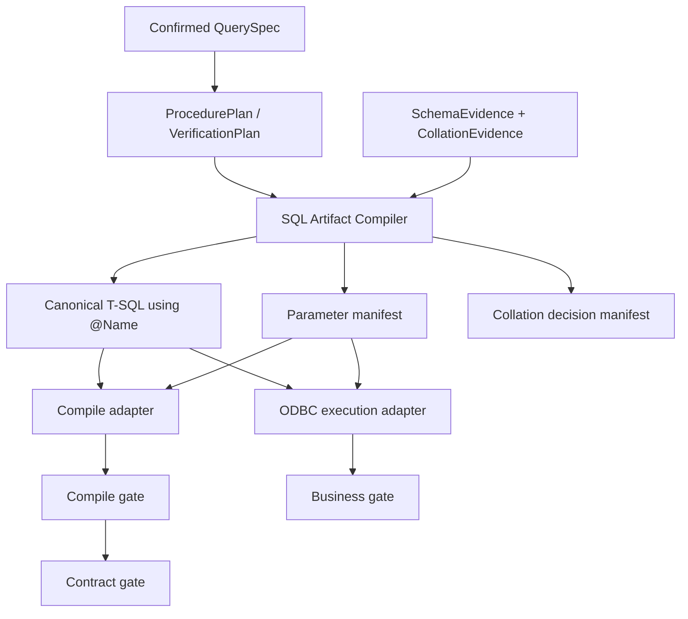

# SQL 参数、排序规则与编译环境根治计划

日期：2026-07-24

## 1. 背景与问题定义

最新会话“新会话19”生成 `usp_ARInvoiceDetail_Query` 后，在 compile gate 同时出现三条错误：

1. 存储过程：

   ```text
   Cannot resolve the collation conflict between
   "SQL_Latin1_General_CP850_CI_AS"
   and
   "SQL_Latin1_General_CP1_CI_AS"
   in the equal to operation. (468)
   ```

2. 两条独立校验 SQL：

   ```text
   The undeclared parameter '@FromDate' is used more than once
   in the batch being analyzed. (11508)
   ```

系统执行了两轮模型修复，最终仍失败并保存为 `verify_failed` 草稿。

这不是单条 SQL 的偶发写法问题，而是三项系统性缺陷叠加：

### 1.1 参数协议存在多个事实源

当前链路同时存在：

- QuerySpec 参数名：`@FromDate`
- 校验 SQL 模板占位符：`{FromDate}`
- SQL Server 原生变量：`@FromDate`
- ODBC 执行参数：`?`

`describe_query_references()` 只扫描 `{Name}` 并据此构造
`sp_describe_first_result_set @params`。模型生成原生 `@FromDate` 时，
编译器不会声明该参数。

参数解析、静态编译和实际执行还分别使用不同的转换函数，无法保证同一条
SQL 在各阶段具有一致语义。

### 1.2 SchemaEvidence 缺少排序规则事实

当前 SchemaEvidence 记录字段名、类型、长度、精度、可空性和描述，但不记录：

- 目标数据库默认 collation
- 字段级 `collation_name`
- 编译环境数据库及其 collation
- SQL Server compatibility level

因此 schema gate 可以通过，但生成和编译阶段没有足够证据判断字符比较、
`UNION`、`CASE` 或排序是否会发生 collation 冲突。

### 1.3 编译环境与部署环境不一致

当前 procedure compile probe 会把真实过程改写成 `#compile_xxx` 临时过程。
临时过程处于 `tempdb` 语境，而最终过程部署到目标业务数据库。

当目标数据库与 `tempdb` 的默认 collation、兼容级别或对象解析语境不一致时，
probe 结果不再可靠：

- 可能误报实际可部署的 SQL；
- 也可能漏报实际部署时才出现的错误。

### 1.4 确定性错误被错误地交给模型修复

参数声明、排序规则适配和编译环境选择都应由程序确定。当前模型修复无法获得
完整 collation 证据，也不知道编译器的隐含占位符协议，只能反复猜测并消耗
修复次数。

## 2. 根治目标

### 2.1 功能目标

- SQL 制品内部只存在一种规范参数表示：SQL Server 原生 `@Name`。
- 参数定义只来源于 QuerySpec，生成文本不能重新定义参数契约。
- 静态编译和实际执行共用同一个参数解析与绑定组件。
- SchemaEvidence 完整记录数据库和字符字段 collation。
- 所有 collation 决策由确定性编译器完成，不依赖模型补写
  `COLLATE DATABASE_DEFAULT`。
- procedure compile probe 与最终部署使用等价的数据库语境。
- 参数、collation 和环境类错误不再进入模型修复循环。
- 旧 `{Name}` 校验 SQL 可以安全迁移，但新制品不得继续产生旧格式。

### 2.2 安全目标

- 不通过字符串拼接注入运行参数值。
- 不为了测试修改真实业务数据。
- 默认单元测试不连接真实 LLM 或 SQL Server。
- SQL Server 集成测试只在显式配置的隔离测试库中运行。
- `test_e2e.py` 仅在用户明确要求、Windows 环境和配置完整时运行。
- 未通过全部 gate 的候选仍不可部署。

### 2.3 可观测性目标

compile gate 的结构化错误至少包含：

- artifact
- error code
- compile method
- compile database
- target database
- target database collation
- compile database collation
- parameter references
- collation-sensitive expression 或 SQL Server 返回的行号
- 是否属于 deterministic/compiler error
- 是否允许模型修复

## 3. 非目标

- 不通过简单增加提示词来宣称问题已解决。
- 不在生成 SQL 上进行无差别的全局 `COLLATE` 注入。
- 不永久支持两套参数语法。
- 不修改真实业务数据库的默认 collation。
- 不在本计划中重构无关的会话、界面或部署功能。
- 不把所有 SQL 业务逻辑一次性改造成通用数据库 ORM。
- 不引入无法解释 SQL 改写结果的黑盒自动修复。

## 4. 目标架构



核心原则：

1. QuerySpec 是参数和业务契约的唯一事实源。
2. SchemaEvidence 是物理对象、类型和 collation 的唯一事实源。
3. SQL Artifact Compiler 是 SQL 表示转换的唯一入口。
4. compile adapter 和 execution adapter 只消费编译器产物，不各自解析一遍 SQL。
5. 模型只能产生业务计划或候选表达式，不能决定参数绑定和 collation 策略。

## 5. 核心数据契约

### 5.1 CanonicalParameter

新增内部参数定义：

```json
{
  "name": "@FromDate",
  "binding_name": "FromDate",
  "sql_type": "DATETIME",
  "required": true,
  "default": null
}
```

规则：

- `name` 必须符合 `^@[A-Za-z_][A-Za-z0-9_]*$`。
- 大小写比较遵循 SQL Server 参数名不区分大小写的规则。
- 同一过程不允许仅大小写不同的重复参数。
- SQL 文本只能引用 QuerySpec 已声明参数。
- 类型只能来自 QuerySpec，不允许从 SQL 文本或运行值推断。

### 5.2 CompiledSqlArtifact

新增统一编译产物：

```json
{
  "artifact_type": "procedure | verification",
  "canonical_sql": "SELECT ... WHERE DocDate >= @FromDate",
  "parameters": [
    {
      "name": "@FromDate",
      "sql_type": "DATETIME",
      "occurrences": 2
    }
  ],
  "odbc_sql": "SELECT ... WHERE DocDate >= ?",
  "odbc_parameter_order": ["FromDate"],
  "collation_decisions": [],
  "diagnostics": []
}
```

约束：

- `canonical_sql` 是持久化和静态编译使用的规范 SQL。
- `odbc_sql` 只在执行边界产生，不作为新的持久化事实源。
- 同一参数引用多次时，ODBC 绑定顺序必须包含对应的多次引用。
- 参数扫描必须忽略字符串、行注释、块注释和带引号标识符。

### 5.3 CollationEvidence

扩展 SchemaEvidence：

```json
{
  "database_name": "SBODemo",
  "database_collation": "SQL_Latin1_General_CP850_CI_AS",
  "compatibility_level": 150,
  "objects": [
    {
      "schema": "dbo",
      "name": "OINV",
      "columns": [
        {
          "name": "CardCode",
          "sql_type": "nvarchar",
          "collation_name": "SQL_Latin1_General_CP850_CI_AS"
        }
      ]
    }
  ]
}
```

规则：

- 非字符字段 `collation_name=null`。
- 数据库 collation、compatibility level 和字段 collation 都进入 fingerprint。
- schema 刷新后任一项变化，都必须使旧候选失效并重新编译。

### 5.4 CollationDecision

编译器记录每次确定性转换：

```json
{
  "expression_path": "set_operations[0].outputs[2]",
  "operation": "UNION ALL",
  "left_collation": "SQL_Latin1_General_CP850_CI_AS",
  "right_collation": "SQL_Latin1_General_CP1_CI_AS",
  "target_collation": "SQL_Latin1_General_CP850_CI_AS",
  "reason": "set operator text output requires compatible collation"
}
```

不得只记录修改后的 SQL，而不记录决策原因。

## 6. 参数编译器设计

### 6.1 单一规范

新生成的 procedure 和 verification SQL 均使用 `@Name`：

```sql
WHERE inv.DocDate BETWEEN @FromDate AND @ToDate
```

不再要求模型生成 `{FromDate}`。

### 6.2 安全词法扫描

新增轻量 T-SQL scanner，至少区分：

- 普通 SQL
- `'字符串'`
- `N'Unicode 字符串'`
- `-- 行注释`
- `/* 块注释 */`
- `[带括号标识符]`
- `"带引号标识符"`
- `@@系统变量`

只在普通 SQL 状态识别单 `@Name`。

第一阶段不需要构建完整 SQL AST，但不得用单个正则表达式扫描全部 SQL。

### 6.3 参数契约校验

编译前执行：

1. 收集 SQL 中所有参数引用及出现位置。
2. 与 ProcedureSpec 参数集合比较。
3. 未声明引用：contract gate 失败，错误码 `undeclared_parameter`。
4. QuerySpec 过滤条件声明引用但 SQL 未使用：contract gate 失败，
   错误码 `missing_parameter_usage`。
5. 过程签名、verification SQL 和运行默认值共用同一份参数 manifest。

### 6.4 静态编译

verification SQL 调用：

```sql
EXEC sys.sp_describe_first_result_set
    @tsql = ?,
    @params = ?,
    @browse_information_mode = 0;
```

其中：

- `@tsql` 保留原生 `@Name`。
- `@params` 直接由 QuerySpec 生成。
- 参数重复引用不重复声明。
- 不再依赖 SQL 中是否出现 `{Name}`。

### 6.5 实际执行

执行 adapter 根据词法扫描结果把 `@Name` 转为 `?`，同时生成严格有序的值列表。

禁止：

- 把日期、客户代码等值直接替换成 SQL 字面量。
- compile 和 execute 使用不同参数发现逻辑。
- 找不到参数时保留原 SQL 继续执行。

## 7. Collation 编译设计

### 7.1 collation 目标选择

默认目标是目标数据库明确返回的 `database_collation`，不是运行时语境中的
`DATABASE_DEFAULT`。

目标 collation 必须：

- 来自目标 SQL Server 元数据；
- 通过 `sys.fn_helpcollations()` 或已捕获元数据校验；
- 作为标识符安全渲染，不接受模型自由输入。

### 7.2 需要规划的表达式

确定性 planner 至少覆盖：

- 字符列与字符列的比较；
- 字符列与字符参数的比较；
- 字符 JOIN key；
- `UNION / UNION ALL / EXCEPT / INTERSECT` 的字符输出位；
- `CASE / COALESCE / ISNULL` 的字符分支；
- 字符串连接；
- 字符表达式的 `GROUP BY`、`ORDER BY`；
- 临时表字符列与业务表字符列的比较。

### 7.3 计划表示

为了避免对自由文本 SQL 做危险的正则改写，逐步引入结构化 SQL plan：

```json
{
  "kind": "binary_predicate",
  "operator": "=",
  "left": {
    "kind": "column",
    "source_alias": "inv",
    "column": "CardCode"
  },
  "right": {
    "kind": "parameter",
    "name": "@CardCode"
  }
}
```

生成流程调整为：

1. 模型基于 QuerySpec 和 SchemaEvidence 生成 ProcedurePlan /
   VerificationPlan。
2. Pydantic 严格校验 plan。
3. 程序解析列类型和 collation。
4. renderer 生成最终 T-SQL。

迁移期允许旧自由文本 SQL 继续进入只读校验，但不对其做自动 collation 改写；
无法证明安全时返回结构化 compile diagnostic，要求重新生成结构化 plan。

### 7.4 不允许的方案

- 给所有字符列无差别添加 `COLLATE DATABASE_DEFAULT`。
- 只针对错误码 468 做字符串替换。
- 把 SQL Server 错误原文交给模型反复猜测。
- 假设同一 SAP B1 数据库内所有文本列 collation 一致。

## 8. 编译环境一致性设计

### 8.1 查询型 procedure

对于 reporting procedure：

1. renderer 同时产出 procedure DDL 和可描述的查询主体。
2. 查询主体使用 QuerySpec 参数 manifest。
3. compile adapter 在目标数据库连接上调用
   `sp_describe_first_result_set`。
4. 不创建 `#compile_xxx` 临时过程。
5. procedure header、参数签名和查询结果元数据分别校验，最后合并为 compile result。

### 8.2 复杂控制流或写入型 procedure

对不能通过查询主体完整描述的 procedure：

- 只允许在显式配置的 compile/test 数据库中探测；
- compile 数据库必须与目标库具有相同：
  - database collation
  - compatibility level
  - 被引用对象 schema
- compile 对象使用唯一名称；
- 在显式事务中创建并回滚；
- 禁止在真实生产数据库创建 probe 对象；
- compile 环境不满足时返回 `compile_environment_mismatch`，不得降级到
  `tempdb` 临时过程。

### 8.3 环境预检

compile gate 前比较：

```text
target database collation
compile database collation
target compatibility level
compile compatibility level
schema fingerprint
```

任一关键项不一致时停止编译并给出配置错误，不把它伪装成 SQL 语法错误。

## 9. 模型职责调整

### 9.1 模型仍负责

- 根据 QuerySpec 选择业务查询结构。
- 产生 ProcedurePlan 和独立 VerificationPlan。
- 在业务语义、聚合、JOIN 或输出契约错误时定向修复 plan。

### 9.2 程序负责

- 参数引用、声明和绑定。
- 标识符安全渲染。
- SQL 类型渲染。
- collation 推导与转换。
- procedure DDL 包装。
- 静态编译环境选择。
- compile error 分类。

### 9.3 修复策略

以下错误标记 `repairable=false`，不得调用模型：

- `undeclared_parameter`
- `missing_parameter_usage`
- `invalid_parameter_type`
- `collation_evidence_missing`
- `compile_environment_mismatch`
- `compiler_invariant_violation`

以下错误可在刷新 SchemaEvidence 后重试一次：

- SQL Server 207：字段不存在
- SQL Server 208：对象不存在
- schema fingerprint 变化

只有业务计划或 SQL plan 语义错误才进入模型修复，且修复后从第一道 gate
重新验证。

## 10. 分阶段实施任务

## 阶段 0：固化会话19回归证据

### Task 0.1：增加离线回归 fixture

涉及文件：

- 新增 `tests/fixtures/session_19_compile_failure.json`
- 修改 `test_generation_harness.py`

内容：

- 保存最小化的 ProcedureSpec。
- 保存两条包含重复 `@FromDate` 的 verification SQL。
- 保存混合 collation SchemaEvidence。
- 不复制数据库密码、连接字符串或真实业务数据。

验证：

```powershell
.venv\Scripts\python.exe -m pytest test_generation_harness.py -q
```

预期：

- 旧逻辑测试能够稳定复现参数未声明的原因。
- fixture 不依赖 LLM 或 SQL Server。

### Task 0.2：增加错误分类断言

涉及文件：

- `test_generation_harness.py`
- `test_validation_service.py`

验证：

- 参数协议错误不再被归类为普通 SQL 语法错误。
- deterministic error 不消耗模型 repair count。

## 阶段 1：建立统一参数编译器

### Task 1.1：新增参数 scanner 和数据模型

涉及文件：

- 新增 `app/services/sql_artifact_compiler.py`
- 新增 `test_sql_artifact_compiler.py`

实现：

- `scan_parameter_references(sql)`
- `validate_parameter_contract(sql, parameter_specs, expected_refs)`
- `build_describe_parameter_declaration(parameter_specs)`
- `compile_odbc_binding(sql, values)`

单元测试：

- 参数重复引用。
- 大小写差异。
- 字符串中的 `@Name`。
- 注释中的 `@Name`。
- `@@ROWCOUNT` 等系统变量。
- 未声明参数。
- 缺少必需参数。
- 同名不同大小写的重复参数定义。

验证：

```powershell
.venv\Scripts\python.exe -m pytest test_sql_artifact_compiler.py -q
```

### Task 1.2：让 compile 和 execute 共用编译器

涉及文件：

- `app/db/sqlserver.py`
- `app/services/validation.py`
- `app/services/candidate_pipeline.py`
- `test_validation_service.py`
- `test_generation_harness.py`

实现：

- `describe_query_references()` 不再扫描 `{Name}`。
- `_bind_query_params()` 或等价逻辑改为消费 `CompiledSqlArtifact`。
- 删除重复的参数解析和类型回退逻辑。
- compiler 接口接收结构化 parameter manifest。

验证：

- `@FromDate` 引用两次仍只声明一次。
- 编译和执行得到相同参数集合和顺序。
- 未声明参数在连接数据库前失败。

### Task 1.3：迁移旧 `{Name}` 制品

涉及文件：

- `app/db/sqlite.py`
- `app/routes/verify.py`
- `test_validation_service.py`

策略：

- 新增带版本号的 `sql_parameter_syntax_version`。
- 读取旧 verification SQL 时通过安全 scanner 转换 `{Name}` 为 `@Name`。
- 转换后立即执行参数契约校验。
- 新保存制品一律使用新版本。
- 迁移失败时保留原 SQL，标记 `needs_review`，不得静默改写。
- 不直接批量覆盖所有历史数据库记录。

验证：

- 旧会话仍可打开和重新校验。
- 新会话不再产生 `{Name}`。
- 花括号出现在字符串或 JSON 中时不被误改。

## 阶段 2：扩展 SchemaEvidence

### Task 2.1：采集数据库环境元数据

涉及文件：

- `app/db/sqlserver.py`
- `app/services/schema_evidence.py`
- `test_generation_harness.py`

`read_schema_objects()` 增加：

- `database_collation`
- `compatibility_level`
- 每个字段的 `collation_name`

验证：

- 字符字段返回 collation。
- 数字、日期字段返回 null。
- loader 缺少新字段时严格失败，不使用猜测默认值。

### Task 2.2：更新 fingerprint

涉及文件：

- `app/services/schema_evidence.py`
- `test_generation_harness.py`

验证：

- 仅字段 collation 改变也会改变 fingerprint。
- 仅 compatibility level 改变也会改变 fingerprint。
- captured_at 不参与 fingerprint。
- 对象和字段顺序不影响 fingerprint。

### Task 2.3：持久化与展示兼容

涉及文件：

- `app/db/sqlite.py`
- `app/routes/session.py`
- `app/templates/index.html`（仅在需要显示诊断时）

验证：

- 旧 SchemaEvidence 被识别为缺少环境证据，需要刷新。
- 不把旧 evidence 自动当成目标数据库默认 collation。

## 阶段 3：引入结构化 SQL plan 和 collation planner

### Task 3.1：定义最小表达式模型

涉及文件：

- `app/services/generation_harness.py`
- 新增 `app/services/sql_plan.py`
- 新增 `test_sql_plan.py`

首批支持：

- column
- parameter
- literal
- unary predicate
- binary predicate
- arithmetic
- function
- case
- projection
- join
- where
- union_all
- order_by

约束：

- 所有列引用必须绑定到 SourceSpec。
- 所有参数引用必须绑定到 ParameterSpec。
- 模型不得直接提供 `COLLATE` 字符串。

### Task 3.2：实现类型和 collation 推导

涉及文件：

- 新增 `app/services/collation_planner.py`
- `app/services/schema_evidence.py`
- `test_sql_plan.py`

验证矩阵：

- 同 collation 字符列比较：不注入转换。
- 异 collation 字符列比较：转换到目标数据库 collation。
- 字符参数与字符列比较。
- 两个 `UNION ALL` 分支字符输出不同。
- `CASE` 分支不同。
- 非字符表达式不产生 collation decision。
- 缺少字段 collation 时明确失败。

### Task 3.3：实现确定性 T-SQL renderer

涉及文件：

- 新增 `app/services/tsql_renderer.py`
- `app/agent/nodes.py`
- `app/agent/prompts.py`
- `test_sql_plan.py`

实现：

- 模型生成 plan，不生成最终 collation 和参数绑定语法。
- renderer 输出规范 `@Name`。
- renderer 安全引用 schema、表、列和 procedure 名。
- renderer 输出 collation decision manifest。

验证：

- 会话19的 plan 能生成无参数协议漂移的 procedure 和 verification SQL。
- 相同 plan 和 evidence 总是生成完全一致的 SQL。
- 更换模型不改变底层参数和 collation 策略。

### Task 3.4：迁移生成和修复节点

涉及文件：

- `app/agent/nodes.py`
- `app/agent/prompts.py`
- `app/services/candidate_pipeline.py`
- `test_generation_harness.py`

实现：

- `_generate_procedure_candidate()` 返回 ProcedurePlan。
- `_generate_oracle_candidates()` 返回 VerificationPlan。
- `_repair_candidate()` 只修 plan 的业务部分。
- renderer 之后禁止模型直接修改最终 SQL。

验证：

- repair invariant 同时覆盖 QuerySpec、plan 和 renderer manifest。
- 模型修复不能修改参数定义、目标 collation 或 compile environment。

## 阶段 4：消除 tempdb 编译偏差

### Task 4.1：查询型 procedure 使用查询主体编译

涉及文件：

- `app/db/sqlserver.py`
- `app/services/candidate_pipeline.py`
- `test_generation_harness.py`
- `test_sqlserver_compile_integration.py`

实现：

- renderer 分别提供 procedure DDL 和 query body。
- query body 通过 `sp_describe_first_result_set` 校验。
- procedure header 和参数签名由 deterministic parser 校验。
- 删除 reporting procedure 的 `#compile_xxx` 路径。

离线验证：

```powershell
.venv\Scripts\python.exe -m pytest test_generation_harness.py -q
```

隔离 SQL Server 显式验证：

```powershell
.venv\Scripts\python.exe -m pytest test_sqlserver_compile_integration.py -q
```

### Task 4.2：复杂过程增加 compile environment adapter

涉及文件：

- `config.py`
- `app/db/sqlserver.py`
- `app/routes/config.py`（如果现有配置入口需要扩展）
- `test_sqlserver_compile_integration.py`

配置：

- compile database
- compile environment 标识
- 是否允许 DDL probe

规则：

- 默认禁止在业务数据库进行 DDL probe。
- compile database 不匹配时失败，不降级到 tempdb。
- probe 全程事务回滚并验证对象不存在。

### Task 4.3：输出环境诊断

涉及文件：

- `app/services/candidate_pipeline.py`
- `app/routes/chat.py`
- `app/templates/index.html`

界面应区分：

- SQL 本身编译失败
- 参数契约失败
- collation 证据不足
- compile environment 不匹配

不得都显示为“SQL 编译错误”。

## 阶段 5：收紧自动修复和清理旧路径

### Task 5.1：建立错误修复矩阵

涉及文件：

- `app/services/candidate_pipeline.py`
- `app/agent/nodes.py`
- `test_generation_harness.py`

验证：

- deterministic error 不调用 LLM。
- schema 207/208 最多刷新一次。
- plan semantic error 才允许模型修复。
- 同类错误连续出现不会无限重试。

### Task 5.2：删除旧参数替换入口

涉及文件：

- `app/db/sqlserver.py`
- `app/services/validation.py`
- 全仓调用点

候选清理对象：

- `substitute_params()`
- 仅识别 `{Name}` 的 regex
- compile 和 execute 中重复的参数类型解析
- verification prompt 中旧占位符说明

删除前必须先通过：

```powershell
rg -n "\{\\w+\}|substitute_params|replace_placeholder" app
```

预期：

- 不再存在运行中的旧参数转换路径。
- 文档或迁移测试中的旧格式可以保留。

### Task 5.3：删除 reporting procedure 临时编译路径

涉及文件：

- `app/db/sqlserver.py`
- `test_sqlserver_compile_integration.py`

验证：

- reporting procedure compile 不创建 `#compile_xxx`。
- 复杂过程仅走显式 compile environment adapter。

## 11. 测试策略

### 11.1 默认离线测试

每个阶段至少运行与改动匹配的测试：

```powershell
.venv\Scripts\python.exe -m pytest `
  test_sql_artifact_compiler.py `
  test_sql_plan.py `
  test_generation_harness.py `
  test_validation_service.py `
  test_verify_autofix.py -q
```

如新增测试文件尚不存在，按阶段逐步加入命令。

### 11.2 SQL Server 集成测试

仅在显式隔离测试环境中运行：

```powershell
.venv\Scripts\python.exe -m pytest test_sqlserver_compile_integration.py -q
```

覆盖：

- 目标库与 tempdb collation 不同。
- 两张测试表字段 collation 不同。
- 重复参数引用。
- `UNION ALL` 字符输出。
- compile probe 后无残留对象。
- compile 与部署前检查结果一致。

### 11.3 禁止默认运行的测试

- `test_improvements.py`：需要已启动的本地服务。
- `test_e2e.py`：会调用真实 LLM、SQL Server 并生成、校验 SP。

除非用户明确要求，不运行 `test_e2e.py`。

## 12. 数据迁移与兼容策略

### 12.1 版本字段

为持久化候选增加：

- `sql_artifact_version`
- `parameter_syntax_version`
- `schema_evidence_version`
- `compiler_version`

### 12.2 历史候选

- 历史 `{Name}` verification SQL 在重新校验时按需迁移。
- 历史 SchemaEvidence 缺少 collation 时强制刷新。
- 历史 `validated_hash` 不得直接沿用到新 compiler version。
- 已部署过程不自动重新部署。
- 历史失败草稿保持可见，不覆盖用户编辑内容。

### 12.3 灰度顺序

1. 先让新编译器支持读取旧制品。
2. 再让新会话只写新制品。
3. 观察一段时间后删除旧写入路径。
4. 最后删除旧读取兼容。

兼容期也必须保证内部只转换为 canonical `@Name` 后再进入 gate。

## 13. 完成定义

满足以下全部条件才算根治完成：

1. 会话19回归用例无需模型修复即可通过参数 contract。
2. 同一参数重复引用不会产生 SQL Server 11508。
3. SchemaEvidence 能显示目标数据库和相关字符字段的实际 collation。
4. collation 改变会使 schema fingerprint 改变。
5. 混合 collation 的比较和 `UNION ALL` 由 planner 确定性处理。
6. 新生成 SQL 不含 `{Name}` 参数占位符。
7. compile 和 execute 使用同一个参数 manifest。
8. reporting procedure 不再通过 `tempdb` 临时过程编译。
9. compile environment 不一致时返回配置错误，而不是 SQL 语法错误。
10. 参数、collation 和环境错误不调用模型修复。
11. 所有新增离线测试通过。
12. 在显式隔离 SQL Server 中的 compile integration 测试通过。
13. 未通过 gate 的候选继续不可部署。
14. 未修改或连接真实业务数据库来迁就测试结果。

## 14. 实施边界与提交建议

为避免一次提交同时改变过多正确性边界，建议按以下提交拆分：

1. `test: capture session 19 parameter and collation regressions`
2. `feat: add canonical SQL parameter compiler`
3. `refactor: share parameter manifest across compile and execution`
4. `feat: capture database and column collation evidence`
5. `feat: add structured SQL plan and collation planner`
6. `refactor: render SQL deterministically from validated plans`
7. `fix: compile reporting procedures in target database context`
8. `refactor: restrict model repair to semantic plan errors`
9. `chore: migrate legacy artifacts and remove old parameter paths`

每个提交只触及对应阶段，完成相应测试后再进入下一阶段。不得把现有工作区中的
无关修改一起格式化、重写或提交。
