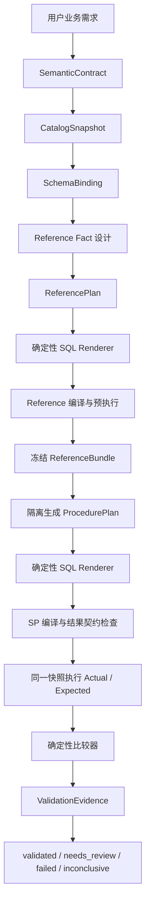

# Schema 到业务校验 V3 根治实施计划

日期：2026-07-25  
状态：待确认  
适用范围：查询型 / 报表型 SQL Server 存储过程

## 1. 执行摘要

当前系统的问题不是某几个 Prompt 或 SQL 模板不够完善，而是从业务需求到最终
校验之间缺少一条单向、唯一事实源驱动的流水线：

- 业务语义、物理 Schema、SQL 实现和比较协议混在同一个 QuerySpec 中；
- 多个模块使用正则或字符串重新解释表、字段、参数和结果列；
- 独立校验 SQL 与 SP 的职责边界不清晰；
- 编译成功、查询可执行、结果为空和业务正确曾被混为同一种“通过”；
- 自动修复可以在错误阶段修改错误对象，导致系统无法稳定收敛；
- 后端虽然区分若干 gate，前端仍缺少准确、可行动的错误展示。

V3 采用以下核心顺序：

1. 用户确认纯业务语义契约；
2. 系统从目标数据库精确绑定 Schema；
3. 在看不到 SP 的前提下生成并预检独立基准查询；
4. 冻结基准查询定义和比较协议，不冻结结果数据；
5. 在看不到基准 SQL 的前提下生成 SP；
6. 在同一数据库快照、同一参数下执行两者；
7. 由确定性比较器判断缺失、多余、重复键和字段差异；
8. 只有具有有效数据覆盖且全部 gate 通过的候选才可标记为 validated。

本计划不兼容历史测试会话，也不迁移旧校验协议。历史数据可直接清理或重新生成。

## 2. 范围与边界

### 2.1 第一阶段必须支持

- 只读查询型存储过程；
- 单结果集；
- 明细查询；
- 单行汇总；
- 多维分组汇总；
- 多来源对账；
- 全量结果集；
- 异常结果集；
- 可选参数；
- 日期区间；
- 字符串、日期、整数和金额比较；
- 有稳定业务键和无稳定业务键的结果。

### 2.2 第一阶段明确不支持

- INSERT、UPDATE、DELETE、MERGE；
- 动态 SQL；
- 多结果集；
- 游标；
- 持久化中间表；
- 业务数据库 DDL；
- 任意用户手写 SQL 的自动部署；
- 旧 `{Parameter}` 占位符；
- 旧 `verify_queries.validation_spec` 推断模式；
- 通用 `zero_rows`；
- 旧会话兼容转换。

写入型 SP 在查询型主链路稳定通过后单独设计，不复用模糊的 `change_set` 兼容层。

### 2.3 SQL 编辑边界

V3 第一阶段中，已进入验证链路的 SQL 由结构化计划确定性渲染：

- 页面可以查看 SQL；
- 用户修改业务要求时返回业务契约或实现反馈阶段重新生成；
- 直接手工编辑后的 SQL 视为 unmanaged draft；
- unmanaged draft 不具备部署资格；
- 后续若要支持任意手写 SQL，必须引入真正的 T-SQL parser，不得恢复正则解析。

## 3. 成功标准

V3 必须提供一条稳定的快乐路径：

```text
正确业务契约
→ 正确 Schema 绑定
→ 正确独立基准查询
→ 正确 SP
→ 同一数据快照下结果一致
→ validated
```

“正确通过”必须同时满足：

- 环境身份正确；
- Schema 全部精确绑定；
- 独立基准查询可编译、可执行；
- SP 可编译、可隔离执行；
- 两边结果契约一致；
- 至少一个覆盖用例的基准结果非空；
- 所有必需比较器通过；
- 验证使用的全部制品 hash 与当前制品一致；
- 后续未发生 Schema 变化。

## 4. 设计原则

### 4.1 单一事实源

| 内容 | 唯一事实源 |
|---|---|
| 业务口径 | SemanticContract |
| 数据库对象和字段 | SchemaBinding |
| 独立基准定义 | ReferenceBundle |
| SP 实现 | ProcedurePlan / ProcedureCandidate |
| 比较协议 | ReferenceBundle.comparator |
| 最终验证结论 | ValidationEvidence |
| 部署资格 | ValidationEvidence + 制品 hash |

任何模块不得从另一个字符串字段反向推断这些信息。

### 4.2 信息隔离

- Reference 生成器看不到 SP 源码或 ProcedurePlan；
- SP 生成器看不到 Reference SQL 或 ReferencePlan；
- 两者只共享冻结的 SemanticContract 和 SchemaBinding；
- 业务结果不一致后，不允许同时自动修改 SP 与 Reference；
- Reference 冻结后只能通过返回设计阶段重新生成，不能在业务对账阶段被修补。

### 4.3 确定性优先

以下内容不得由模型自由输出：

- 数据库、schema、表和字段拼写；
- 标识符引号风格；
- 参数名称和 SQL 参数类型；
- 日期区间边界表达式；
- collation 策略；
- 输出列顺序和类型；
- 比较键、比较列和容差；
- gate 状态；
- 部署资格。

### 4.4 Fail closed

- 无法确认时停止；
- 歧义不自动选择；
- 空数据覆盖不足不算通过；
- 前置 gate 失败时后续 gate 为 not_run；
- 系统内部异常不得映射为业务失败；
- 未知状态不得默认 validated。

## 5. 目标架构



## 6. 核心数据契约

### 6.1 SemanticContract

SemanticContract 只表达业务含义，不包含物理表名和字段名。

建议结构：

```json
{
  "version": 3,
  "contract_id": "uuid",
  "procedure_name": "sp_GetARInvoiceDetail",
  "purpose": "按到期日查询未取消应收发票明细",
  "result_mode": "full_rows",
  "parameters": [
    {
      "id": "from_date",
      "name": "@FromDate",
      "logical_type": "date",
      "required": true,
      "default": null,
      "meaning": "到期日起始日",
      "boundary": "inclusive"
    },
    {
      "id": "to_date",
      "name": "@ToDate",
      "logical_type": "date",
      "required": true,
      "default": null,
      "meaning": "到期日截止日",
      "boundary": "inclusive_full_day"
    }
  ],
  "entities": [
    {
      "id": "invoice_header",
      "meaning": "应收发票头"
    },
    {
      "id": "invoice_line",
      "meaning": "应收发票行"
    }
  ],
  "grain": [
    "invoice_internal_id",
    "invoice_line_number"
  ],
  "outputs": [
    {
      "id": "invoice_internal_id",
      "name": "DocEntry",
      "meaning": "发票内部编号",
      "logical_type": "integer"
    },
    {
      "id": "line_total",
      "name": "LineTotal",
      "meaning": "行金额",
      "logical_type": "money"
    }
  ],
  "filters": [
    {
      "id": "exclude_canceled",
      "meaning": "排除已取消发票"
    },
    {
      "id": "due_date_range",
      "meaning": "到期日在闭区间内"
    }
  ],
  "derived_fields": [],
  "allow_empty": true,
  "money_tolerance": 0.01
}
```

约束：

- `result_mode` 第一阶段只允许 `full_rows`、`exception_rows`、`scalar_summary`；
- 每个输出必须有稳定的业务含义 ID；
- `grain` 引用输出含义 ID，不引用物理列；
- 日期边界必须结构化，不允许只写自由文本；
- 金额必须说明币种或金额口径；
- 用户确认后生成 canonical JSON 和 hash；
- 后续步骤只能引用，不能修改。

### 6.2 CatalogSnapshot

CatalogSnapshot 来自 SQL Server 系统目录，不来自模型记忆。

必须包含：

- server identity；
- database name；
- database id；
- compatibility level；
- database collation；
- default schema；
- 当前账号；
-读取权限；
- objects：schema、name、object_id、type；
- columns：column_id、name、type、max_length、precision、scale、nullable、collation；
- primary key / unique index；
- foreign keys；
- snapshot timestamp；
- fingerprint。

CatalogSnapshot 只读取元数据，不读取业务数据。

### 6.3 SchemaBinding

SchemaBinding 将 SemanticContract 中的实体和字段映射到精确物理身份。

```json
{
  "version": 3,
  "contract_hash": "...",
  "catalog_fingerprint": "...",
  "entities": [
    {
      "entity_id": "invoice_header",
      "database": "B1UP_DEMO",
      "schema": "dbo",
      "object": "OINV",
      "object_id": 1234
    }
  ],
  "fields": [
    {
      "semantic_id": "invoice_internal_id",
      "entity_id": "invoice_header",
      "column": "DocEntry",
      "column_id": 1,
      "sql_type": "int",
      "nullable": false,
      "collation": null
    }
  ],
  "joins": [
    {
      "left_entity": "invoice_header",
      "left_column_id": 1,
      "right_entity": "invoice_line",
      "right_column_id": 1,
      "join_type": "inner",
      "evidence": "sap_b1_business_relation",
      "meaning": "发票头行按 DocEntry 关联"
    }
  ]
}
```

约束：

- 物理对象必须按 object_id 绑定；
- 字段必须按 column_id 绑定；
- 模型只能提出候选，解析器负责确认；
- 同名对象歧义必须失败；
- 关联关系必须记录证据类型；
- SchemaBinding 通过后生成 hash；
- SQL Renderer 只接受绑定 ID，不接受模型自由输入物理名称。

### 6.4 RelationalPlan

第一阶段不让模型直接生成自由 SQL，而是生成受限的结构化关系计划。

支持节点：

- Scan；
- InnerJoin；
- LeftJoin；
- FullJoin；
- Filter；
- Project；
- Aggregate；
- UnionAll；
- DerivedColumn；
- Sort；
- CTE；
- CaseExpression。

支持表达式：

- 绑定字段引用；
- 参数引用；
- 常量；
- AND / OR / NOT；
- =、<>、>、>=、<、<=；
- +、-、*、/；
- IS NULL / IS NOT NULL；
- SUM、COUNT、COUNT DISTINCT、MIN、MAX、AVG；
- ISNULL / COALESCE；
- ABS；
- DATEADD；
- YEAR / MONTH；
- CAST；
- CASE。

禁止：

- 任意 SQL 字符串片段；
- 任意对象名；
- 任意参数名；
- 动态 SQL；
- 子查询字符串；
- 未列入白名单的函数。

SQL Renderer 负责：

- 统一使用 `[schema].[object]`；
- 统一使用 `@Parameter`；
- 根据 logical boundary 生成日期条件；
- 根据类型证据处理 collation；
- 根据绑定类型生成 CAST；
- 保证 GROUP BY、ORDER BY 和别名合法；
- 输出稳定格式；
- 生成 source map，将 SQL 行映射回 plan path。

### 6.5 ReferenceBundle

ReferenceBundle 可以包含一个或多个独立事实。

```json
{
  "version": 3,
  "contract_hash": "...",
  "binding_hash": "...",
  "facts": [
    {
      "fact_id": "invoice_detail_fact",
      "meaning": "满足条件的应收发票明细事实",
      "actual_projection": [
        "DocEntry",
        "LineNum",
        "LineTotal"
      ],
      "reference_plan": {},
      "expected_sql": "SELECT ...",
      "expected_schema": [
        {
          "name": "DocEntry",
          "type_family": "integer"
        }
      ],
      "comparator": {
        "type": "keyed_rows_equal",
        "key_columns": ["DocEntry", "LineNum"],
        "compare_columns": ["LineTotal"],
        "tolerance": {
          "LineTotal": 0.01
        }
      }
    }
  ],
  "validation_cases": [],
  "compile_evidence": {},
  "preflight_evidence": {},
  "bundle_hash": "..."
}
```

约束：

- ReferencePlan 在 SP 生成前形成；
- Reference 生成上下文不包含 SP；
- expected SQL 只能引用 SchemaBinding 中的 object_id；
- 每个 fact 必须声明 actual projection；
- comparator 由程序根据结果形状编译，不由模型自由选择；
- Reference 编译、结果契约和覆盖预检通过后冻结；
- 冻结后结果不一致不得自动修改。

### 6.6 ProcedurePlan 与 ProcedureCandidate

ProcedurePlan 使用相同的受限 RelationalPlan，但生成上下文中不得包含 ReferencePlan
或 expected SQL。

ProcedureCandidate 包含：

- contract hash；
- binding hash；
- procedure plan；
- renderer version；
- SP SQL；
- 参数签名；
- SQL Server 编译证据；
- 实际结果元数据；
-安全证据；
- candidate hash。

### 6.7 ValidationEvidence

```json
{
  "version": 3,
  "candidate_hash": "...",
  "reference_bundle_hash": "...",
  "catalog_fingerprint": "...",
  "database_identity": "...",
  "validation_case": {},
  "stages": [],
  "comparisons": [],
  "coverage": {
    "expected_row_count": 128,
    "actual_row_count": 128,
    "effective": true
  },
  "status": "validated",
  "created_at": "..."
}
```

ValidationEvidence 是唯一验证结论来源。

## 7. 基准查询优先流程

### 7.1 基准事实设计

从 SemanticContract 中识别最小事实，而不是复制整个目标 SP。

示例：应收收入与收入凭证对账。

事实一：

```text
fact_id: invoice_revenue
key: DocEntry
expected value: InvoiceAmount
actual projection: DocEntry, InvoiceAmount
source: 应收发票头/行
```

事实二：

```text
fact_id: journal_revenue
key: 已确认的稳定关联键
expected value: JournalAmount
actual projection: 关联键, JournalAmount
source: 凭证头/分录
```

派生公式：

```text
Difference = InvoiceAmount - JournalAmount
Matched = ABS(Difference) <= Tolerance
```

派生公式由程序直接检查，不生成第三条 SQL。

### 7.2 Reference 编译门

ReferencePlan 渲染后必须在目标数据库语境中执行：

1. 参数契约检查；
2. SQL Server 元数据编译；
3. 输出列名、顺序、类型检查；
4. 只读安全检查；
5. 引用对象与 SchemaBinding identity 检查；
6. compatibility level 检查；
7. collation 检查。

任何失败均不得进入 SP 生成。

### 7.3 Reference 预执行

预执行不产生业务通过，只产生 `reference_ready`。

预执行确认：

- 可正常执行；
- 输出结构与编译元数据一致；
- 业务键在代表性用例下唯一；
- 至少一个覆盖用例返回数据；
- 数值、日期和字符串可以正常序列化。

### 7.4 冻结规则

冻结：

- SemanticContract hash；
- SchemaBinding hash；
- ReferencePlan；
- expected SQL；
- expected schema；
- comparator；
- validation cases；
- renderer version；
- ReferenceBundle hash。

不冻结：

- Reference 查询结果数据。

最终验证必须重新执行 Reference。

## 8. SP 生成流程

### 8.1 生成输入

SP 生成器只接收：

- SemanticContract；
- SchemaBinding；
-结果契约；
- ProcedurePlan JSON Schema；
- SQL Renderer 能力列表。

明确不接收：

- expected SQL；
- ReferencePlan；
- Reference 执行结果；
-历史 SP；
-历史修复 SQL。

### 8.2 生成输出

模型只输出 ProcedurePlan JSON。

程序负责：

- 严格模型校验；
- 绑定 ID 校验；
- 参数覆盖校验；
- 输出血缘校验；
- 关系节点适用性校验；
- SQL 渲染；
-过程头生成。

### 8.3 SP 编译门

按顺序检查：

1. query-only 安全；
2. 参数签名；
3. Schema identity；
4. SQL Server 编译；
5. 单结果集；
6. 输出列名；
7. 输出顺序；
8. 输出类型族；
9. result mode；
10. plan/source map 完整性。

## 9. 最终执行与比较

### 9.1 一致性快照

Actual 与 Expected 必须：

- 使用同一 SQL Server 连接；
- 使用同一数据库；
- 使用同一事务；
- 使用同一参数；
- 使用 SNAPSHOT 隔离；数据库不支持时使用适当的只读一致性策略；
- 验证结束后回滚或清理会话级临时对象。

### 9.2 SP 隔离执行

查询型 SP 使用唯一会话级临时过程名或等价隔离批处理：

- 不创建或覆盖正式 SP；
- 不修改业务表；
- 名称不可与真实对象冲突；
- 完成后清理；
- 清理失败记录 INTERNAL_CLEANUP_FAILED，但不得伪装成业务失败。

### 9.3 比较器

第一阶段只保留三种比较器。

#### keyed_rows_equal

检查：

- Actual 重复键；
- Expected 重复键；
- Missing keys；
- Extra keys；
- 字段差异；
- NULL 语义；
- 字段级容差。

该比较器已经覆盖：

- 无遗漏；
- 不多返回；
- 不返回取消记录；
- 日期范围正确；
-字段值正确。

不得再生成对应的 zero_rows 规则。

#### multiset_rows_equal

用于没有稳定业务键但允许重复行的结果：

- 对标准化后的完整行计数；
- 比较每种行值的出现次数；
- 返回缺少和多出的多重集合计数。

#### scalar_metrics_equal

用于确定性单行结果：

- 每个指标显式映射；
- SUM/COUNT/MIN/MAX/AVG 不混用；
- NULL 与 0 规则由 SemanticContract 决定；
- 金额应用容差；
- Actual 和 Expected 均必须恰好一行。

### 9.4 异常集合

`result_mode=exception_rows` 时：

- Reference 侧生成预期异常集合；
- SP 输出实际异常集合；
- 使用 keyed_rows_equal 或 multiset_rows_equal；
- 不能拿全量 Reference 与异常 SP 直接比较。

## 10. 验证用例与覆盖

### 10.1 覆盖用例

每个 ReferenceBundle 至少有一个 `coverage_case`：

- Expected 至少返回一行；
- 参数来自 Schema-bound 数据探测；
- 参数值和选择依据记录在证据中。

### 10.2 边界用例

按契约能力生成：

- `@ToDate` 当天存在带时间记录；
- 起止日期相同；
- 可选客户为 NULL；
- 可选客户为具体值；
- 合法空期间；
- 金额等于容差；
- 金额刚超过容差；
- NULL 文本或金额；
- 取消记录存在但应被排除。

### 10.3 空结果语义

| Actual | Expected | allow_empty | 结论 |
|---|---|---|---|
| 空 | 空 | true | 当前用例一致，但不能单独构成有效覆盖 |
| 空 | 空 | false | failed |
| 空 | 非空 | 任意 | failed |
| 非空 | 空 | 任意 | failed |

如果全部用例均为空：

```text
status = inconclusive
code = COVERAGE_NO_EFFECTIVE_SAMPLE
```

不得设置 validated。

## 11. Gate 与状态机

### 11.1 Gate 顺序

1. environment；
2. semantic_contract；
3. schema_binding；
4. reference_plan；
5. reference_compile；
6. reference_preflight；
7. procedure_plan；
8. procedure_compile；
9. result_contract；
10. business_comparison；
11. evidence_integrity。

前置失败后，后续全部为 `not_run`。

### 11.2 Gate 状态

- `running`
- `passed`
- `failed`
- `not_run`
- `inconclusive`

### 11.3 制品状态

- `contract_draft`
- `schema_bound`
- `reference_ready`
- `candidate_generated`
- `candidate_compiled`
- `validated`
- `needs_review`
- `failed`
- `deployed`

布尔字段 `syntax_valid`、`business_valid` 只能由 gate 状态派生，不再独立写入。

## 12. 结构化错误协议

### 12.1 Issue 模型

```json
{
  "issue_id": "uuid",
  "code": "SCHEMA_COLUMN_NOT_FOUND",
  "stage": "schema_binding",
  "artifact": "schema_binding",
  "severity": "error",
  "status": "failed",
  "title": "找不到应收发票到期日字段",
  "summary": "目标表 [dbo].[OINV] 中不存在字段 DueDate。",
  "evidence": {
    "requested": "DueDate",
    "candidates": ["DocDueDate", "TaxDate"]
  },
  "location": {
    "contract_path": "outputs.invoice_due_date",
    "plan_path": null,
    "sql_line": null
  },
  "retryable": false,
  "auto_fixable": false,
  "user_action": "请选择正确字段，或修改业务要求。",
  "technical_detail": "原始 SQL Server 或内部诊断",
  "correlation_id": "..."
}
```

### 12.2 错误码前缀

- `ENV_*`
- `CONTRACT_*`
- `SCHEMA_*`
- `REF_*`
- `SP_*`
- `RESULT_*`
- `COMPARE_*`
- `COVERAGE_*`
- `EVIDENCE_*`
- `DEPLOY_*`
- `INTERNAL_*`

### 12.3 错误归类示例

| 现象 | 正确 code | 正确 stage |
|---|---|---|
| 数据库不可连接 | ENV_CONNECTION_FAILED | environment |
| 同名表歧义 | SCHEMA_OBJECT_AMBIGUOUS | schema_binding |
| 引用 SP_RESULT | REF_UNDECLARED_SOURCE | reference_plan |
| CROSS JOIN 带 ON | REF_PLAN_INVALID | reference_plan |
| SQL Server 8127 | REF_COMPILE_FAILED | reference_compile |
| SP 参数缺失 | SP_PARAMETER_MISMATCH | procedure_compile |
| SP 少输出列 | RESULT_COLUMN_MISSING | result_contract |
| SP 漏行 | COMPARE_MISSING_ROWS | business_comparison |
| 双方均空且无覆盖 | COVERAGE_NO_EFFECTIVE_SAMPLE | reference_preflight |
| 清理临时过程失败 | INTERNAL_CLEANUP_FAILED | evidence_integrity |

## 13. 前端错误展示

### 13.1 流水线步骤条

固定展示所有 gate：

```text
业务契约       ✅ 通过
Schema 绑定    ✅ 通过
独立基准查询   ❌ 失败
SP 编译        ⬜ 未执行
结果对账       ⬜ 未执行
```

不得把 not_run 显示为失败。

### 13.2 顶部结论

顶部只展示一条最关键结论：

```text
独立基准查询编译失败，SP 尚未生成。
聚合查询的排序字段未包含在 GROUP BY 中。
系统可在不改变业务口径的前提下修复基准查询计划。
```

原始 ODBC 错误折叠在“技术详情”中。

### 13.3 错误卡片

每张卡片展示：

- 阶段；
- 制品；
- 标题；
- 中文原因；
- 证据；
- SQL 行或契约路径；
- 是否可自动修复；
- 建议操作；
- 技术详情折叠区；
- correlation id。

### 13.4 自动修复展示

自动修复前显示：

```text
正在修复：SP 参数引用错误
允许修改：ProcedurePlan
冻结不变：SemanticContract、SchemaBinding、ReferenceBundle
修复轮次：1/2
```

自动修复后展示结构化差异，不只展示“已修复”。

### 13.5 结果差异展示

摘要：

```text
Expected：128 行
Actual：126 行
缺失：3
多余：1
字段差异：5
```

分页标签：

- Missing；
- Extra；
- Duplicate keys；
- Value differences；
- Coverage；
- Raw evidence。

字段差异表：

| 业务键 | 字段 | SP | 基准 | 容差 |
|---|---|---:|---:|---:|
| 10248 / 1 | LineTotal | 120.00 | 125.00 | 0.01 |

### 13.6 inconclusive 展示

黄色状态：

```text
结果暂时一致，但没有有效数据覆盖。
当前参数下 SP 和独立基准查询均返回 0 行，系统未将其判定为业务通过。
```

## 14. 自动修复边界

### 14.1 允许自动修复

仅允许在不改变冻结事实源时修复：

- ProcedurePlan 结构错误；
- ReferencePlan 结构错误（仅冻结前）；
- 别名冲突；
- 缺少 GROUP BY 投影；
- 排序引用错误；
- 类型兼容的 CAST；
- 确定性日期表达式渲染错误；
- SQL Renderer 的确定性格式问题。

### 14.2 禁止自动修复

- 修改用户确认的业务口径；
- 自动更换业务表；
- 自动选择歧义字段；
- 修改金额口径；
- 修改关联关系；
- 修改比较键；
- 修改容差；
- 结果不一致后修改 Reference 迎合 SP；
- 同时修改 SP 与 Reference；
- 修改数据库 Schema 或业务数据。

### 14.3 不一致归因

业务比较失败时：

1. Reference 已冻结；
2. 检查 Actual 输出契约；
3. 按 missing / extra / value difference 归类；
4. 将差异映射到 ProcedurePlan 节点；
5. 只有能够确定是实现错误时才修复 ProcedurePlan；
6. 无法判断业务契约或实现哪一侧错误时进入 needs_review。

## 15. 持久化设计

不做旧结构兼容。建议重新建立以下表或等价存储：

### semantic_contracts

- id
- session_id
- version
- status
- contract_json
- contract_hash
- created_at
- updated_at

### catalog_snapshots

- id
- database_identity
- fingerprint
- snapshot_json
- created_at

### schema_bindings

- id
- session_id
- contract_hash
- catalog_fingerprint
- binding_json
- binding_hash
- status
- created_at

### reference_bundles

- id
- session_id
- contract_hash
- binding_hash
- bundle_json
- bundle_hash
- status
- created_at

### procedure_candidates

- id
- session_id
- contract_hash
- binding_hash
- reference_bundle_hash
- plan_json
- sql_code
- candidate_hash
- status
- created_at

### validation_runs

- id
- candidate_id
- candidate_hash
- reference_bundle_hash
- catalog_fingerprint
- status
- evidence_json
- created_at

### validation_issues

- id
- validation_run_id
- stage
- code
- issue_json
- created_at

### validation_differences

- id
- validation_run_id
- fact_id
- difference_type
- key_json
- difference_json
- created_at

所有 hash 必须由 canonical JSON 和实际 SQL制品共同计算。

## 16. 后端模块规划

建议新建或重写为以下职责边界：

### app/contracts/semantic.py

- SemanticContract 模型；
- 业务契约校验；
- canonical JSON；
- hash。

### app/contracts/relational_plan.py

- RelationalPlan；
-表达式 AST；
-节点白名单；
- plan 校验。

### app/services/catalog.py

- 环境预检；
- SQL Server CatalogSnapshot；
- fingerprint。

### app/services/schema_binding_v3.py

- 候选解析；
-精确 identity 绑定；
-关联证据；
-歧义诊断。

### app/services/reference_planner.py

- 业务事实拆分；
- comparator 编译；
- ReferencePlan 生成上下文；
- ReferenceBundle 冻结。

### app/services/sql_renderer_v3.py

- 关系计划到 T-SQL；
-统一参数；
-统一标识符；
-统一日期边界；
-类型与 collation；
- source map。

### app/services/sql_compile_v3.py

- SQL Server 元数据编译；
-结果集元数据；
-错误标准化；
-目标数据库语境保证。

### app/services/validation_cases.py

-覆盖参数选择；
-边界用例生成；
- coverage 判定。

### app/services/procedure_generator_v3.py

- 隔离生成上下文；
- ProcedurePlan 生成；
-候选 hash。

### app/services/validation_runner_v3.py

-一致性事务；
-临时过程；
- Actual / Expected 执行；
-清理；
- ValidationEvidence。

### app/services/comparators.py

- keyed rows；
- multiset rows；
- scalar metrics；
-差异限制与分页。

### app/services/issues.py

-统一 Issue；
-错误码；
- SQL Server 错误映射；
-用户提示与技术详情。

### app/routes/v3_*.py

-契约；
- Schema；
- Reference；
-候选；
-验证；
-证据；
-部署。

旧节点和旧路由在 V3 完成后删除，不长期双轨运行。

## 17. 实施阶段

### Phase 0：建立失败样本与验收基线

目标：在重写前把已观察到的问题固化成测试。

任务：

1. 提取会话 7、8、9、15、19、20、21 的关键 SQL 和错误；
2. 建立独立 fixture，不依赖 SQLite 历史数据；
3. 添加以下回归用例：
   - 聚合 ORDER BY 非法；
   - CROSS JOIN ... ON；
   - 参数重复引用；
   - collation 468；
   - `"dbo"."OINV"`；
   - `[dbo].[OINV]`；
   - `SP_RESULT`；
   - 错误 zero_rows；
   -截止日全天不一致；
   -双方空结果；
   - syntax failed / business passed 矛盾状态。

验收：

- 每个 fixture 在旧链路中能复现问题；
- 每个 fixture 在目标设计中有唯一预期 gate 和错误码。

### Phase 1：SemanticContract、Issue 和状态机

任务：

1. 实现 SemanticContract V3；
2. 删除旧 VerificationRuleSpec 兼容字段；
3. 实现统一 Issue；
4. 实现 gate 状态机；
5. 禁止独立写入 syntax_valid / business_valid；
6. 添加 canonical hash。

验收：

- 后续阶段不能修改已确认契约；
- 前置失败后后续为 not_run；
- 所有错误有稳定 code；
- 同一错误前后端展示一致。

### Phase 2：CatalogSnapshot 与 SchemaBinding

任务：

1. 实现环境预检；
2. 读取系统目录完整元数据；
3. 按 object_id / column_id 绑定；
4. 实现候选、歧义和缺失诊断；
5. 实现 join evidence；
6. 生成 fingerprint；
7. 删除字符串对象身份比较。

验收：

- 合法引号风格不影响 identity；
- 同名表不自动选择；
- 不存在字段在 SQL生成前失败；
- collation 和 compatibility level 可追溯。

### Phase 3：RelationalPlan 与 SQL Renderer

任务：

1. 实现节点和表达式模型；
2. 实现白名单校验；
3. 实现绑定 ID 引用；
4. 实现 T-SQL Renderer；
5. 实现日期边界；
6. 实现参数；
7. 实现聚合和排序合法性；
8. 实现 source map。

验收：

- Renderer 不产生 CROSS JOIN ... ON；
- Renderer 不产生非法 GROUP BY / ORDER BY；
- 所有对象统一为方括号；
- SQL中不存在未声明参数；
- 不允许嵌入任意 SQL片段。

### Phase 4：Reference 优先链路

任务：

1. 实现事实拆分；
2. 实现 comparator 确定性编译；
3. 隔离 Reference 生成上下文；
4. 实现 Reference 编译门；
5. 实现覆盖用例选择；
6. 实现预执行；
7. 实现 ReferenceBundle 冻结。

验收：

- Reference 不依赖 SP；
- Reference 不引用未声明对象；
- `SP_RESULT` 在 plan gate 被拒绝；
-全部空结果只能 inconclusive；
- Reference 冻结后 hash 稳定。

### Phase 5：SP 生成与编译

任务：

1. 隔离 ProcedurePlan 生成上下文；
2. 禁止传入 ReferencePlan / SQL；
3. 实现 SP Renderer；
4. 实现 query-only 安全门；
5. 实现 SQL Server 编译；
6. 实现实际结果契约检查；
7. 实现受约束的 ProcedurePlan 修复。

验收：

- SP 看不到 Reference 实现；
- 编译错误不进入业务阶段；
-输出列缺失在 result_contract gate 失败；
-修复不改变契约或 Reference。

### Phase 6：同快照执行与比较

任务：

1. 实现一致性事务；
2. 实现临时过程；
3. 执行 Actual；
4. 执行 Expected；
5. 实现三种比较器；
6. 实现派生字段断言；
7. 实现 coverage；
8. 持久化 ValidationEvidence。

验收：

- Missing / Extra / Duplicate / Value difference 分类准确；
-金额容差准确；
- NULL 语义准确；
-同一参数同一快照；
-失败不修改 Reference。

### Phase 7：前端与错误展示

任务：

1. 新增流水线步骤条；
2. 新增顶部结论；
3. 新增结构化错误卡片；
4. 新增技术详情折叠；
5. 新增自动修复边界展示；
6. 新增差异摘要；
7. 新增差异分页；
8. 新增 inconclusive 状态；
9. 删除模糊的“语法/业务”二元展示。

验收：

- 用户无需阅读 ODBC 原文即可知道下一步；
- not_run 不显示失败；
-空覆盖不显示绿色；
-每个错误能定位契约路径、plan path 或 SQL 行；
-差异可定位到业务键和字段。

### Phase 8：端到端验收与旧链路删除

任务：

1. 使用隔离 SQL Server 测试环境；
2. 运行真实 Schema → Reference → SP → Compare；
3. 覆盖四类查询；
4. 注入错误验证 gate；
5. 删除旧 compatibility、zero_rows、旧参数语法和旧验证路由；
6. 清理历史测试数据。

验收：

- V3 主链路不存在旧字段推断；
-所有正确案例端到端 validated；
-所有错误案例在准确 gate 失败；
-旧路由不能绕过 V3 部署门禁。

## 18. 测试策略

### 18.1 单元测试

- SemanticContract 校验；
- canonical hash；
- Schema identity；
- RelationalPlan；
- SQL Renderer；
- comparator；
- Issue 映射；
-状态机；
- coverage。

### 18.2 编译集成测试

在配置完整的 SQL Server 隔离环境中验证：

- Reference 编译；
- SP 编译；
-结果元数据；
-参数重复引用；
-目标 collation；
-compatibility level；
-临时过程清理。

### 18.3 端到端案例

至少四类：

1. 应收发票头明细；
2. 应收发票头行明细；
3. 按月份 / 客户 / 科目汇总；
4. 发票收入与凭证收入对账。

每类都要有：

- 正确实现通过；
- 删除过滤条件失败；
- 修改 JOIN 失败；
- 修改日期边界失败；
- 修改金额字段失败；
- 删除输出列失败；
- Reference 为空覆盖不足；
- Schema 变化失效。

### 18.4 测试命令

默认单元测试使用项目虚拟环境：

```powershell
.\.venv\Scripts\python.exe -m pytest `
  test_semantic_contract_v3.py `
  test_schema_binding_v3.py `
  test_relational_plan.py `
  test_sql_renderer_v3.py `
  test_reference_bundle.py `
  test_comparators_v3.py `
  test_issue_protocol.py `
  test_validation_state_machine_v3.py `
  -q --basetemp=.pytest_tmp_v3
```

SQL Server 集成测试和 `test_e2e.py` 仅在 Windows、隔离测试库配置完整且用户明确要求
E2E 时执行。

## 19. 端到端验收矩阵

| 场景 | 预期 |
|---|---|
| 正确明细 SP | validated |
| 正确汇总 SP | validated |
| 正确跨事实对账 SP | validated |
| `"dbo"."OINV"` 与 `[dbo].[OINV]` | identity 一致，不误报 |
| 引用 SP_RESULT | REF_UNDECLARED_SOURCE |
| 缺少表 | SCHEMA_OBJECT_NOT_FOUND |
| 同名表歧义 | SCHEMA_OBJECT_AMBIGUOUS |
| 缺少字段 | SCHEMA_COLUMN_NOT_FOUND |
| 参数缺失 | SP_PARAMETER_MISMATCH |
| 非法聚合排序 | plan gate 或 compile gate 失败 |
| CROSS JOIN 带 ON | plan gate 失败 |
| 删除取消过滤 | COMPARE_EXTRA_ROWS |
| 日期截止日写成零点 | COMPARE_MISSING_ROWS |
| 修改金额字段 | COMPARE_VALUE_MISMATCH |
| SP 少返回行 | COMPARE_MISSING_ROWS |
| SP 多返回行 | COMPARE_EXTRA_ROWS |
| 重复业务键 | COMPARE_DUPLICATE_KEY |
|双方均空且无其他覆盖 | COVERAGE_NO_EFFECTIVE_SAMPLE |
| Schema 指纹变化 | EVIDENCE_SCHEMA_CHANGED |
|候选 hash 变化 | EVIDENCE_CANDIDATE_CHANGED |
|前置失败 | 后续全部 not_run |

## 20. Definition of Done

只有满足以下全部条件，V3 才算完成：

1. 查询型 SP 从 SemanticContract 到 ValidationEvidence 全链路实现；
2. 没有旧协议推断；
3. 没有通用 zero_rows；
4. 没有正则对象解析作为事实源；
5. 没有 `{Parameter}`；
6. Reference 在 SP 前生成并冻结；
7. SP 生成上下文不包含 Reference 实现；
8. Actual / Expected 同快照执行；
9. 空结果不能单独构成有效覆盖；
10. 正确四类案例全部端到端 validated；
11. 注入错误全部在准确 gate 失败；
12. 前端准确展示 failed、not_run 和 inconclusive；
13. 每个错误提供用户行动建议和折叠技术详情；
14. 未通过全部必需 gate 的候选无法部署；
15. 当前 SQL、契约、Schema 和证据 hash 完整绑定。

## 21. 关键决策总结

- 不兼容历史测试数据；
- 不双轨长期运行；
- 第一阶段只做查询型 SP；
- Reference 定义先于 SP 生成；
- Reference 预执行不等于业务通过；
- 冻结查询定义，不冻结查询结果；
- SemanticContract 与 SchemaBinding 分离；
- 模型输出结构化计划，不输出任意物理 SQL；
- SQL Renderer 统一对象、参数、日期和 collation；
- 删除通用 zero_rows；
- 结果不一致后只允许修复 SP，不能同步修改 Reference；
- 错误协议和前端展示与后端 gate 同期完成；
- 有效数据覆盖是 validated 的必要条件。
