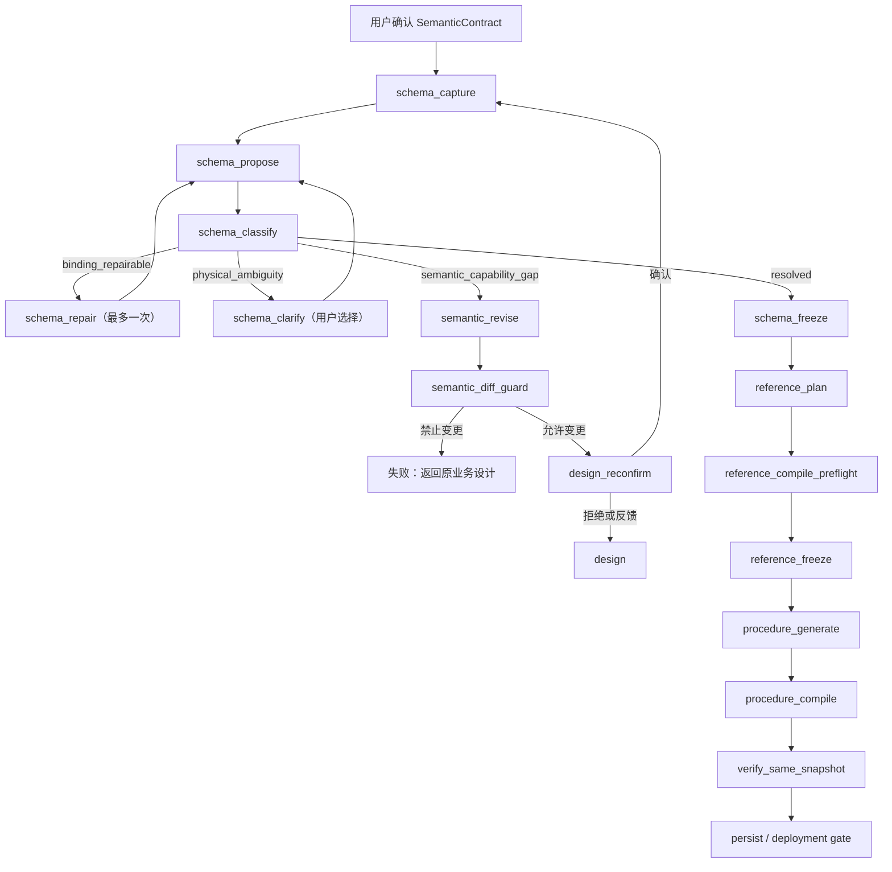

# Schema 解析状态机根因重构实施计划

日期：2026-07-26  
状态：核心实现完成，真实 E2E 未通过稳定性验收  
适用范围：V3 查询型 / 报表型 SQL Server 存储过程生成链路  
兼容策略：当前会话和数据均为测试数据，不兼容旧会话，不迁移旧中断状态

## 1. 结论

本轮不再为“未税收入应该绑定哪个字段”等具体案例增加字段名规则，也不继续扩大
`generate` 节点里的自动重试。真正需要修复的是阶段边界：

```text
已确认的业务设计
→ 真实 Catalog
→ Schema 可实现性判断
→ 必要时由用户选择物理绑定，或受限修订业务实现形状
→ 再次确认发生变化的设计
→ 冻结 SchemaBinding
→ 独立 Reference 编译、执行并冻结
→ 隔离生成 SP
→ 同一快照下比较结果
→ 形成部署资格
```

当前失败的根因是：`SemanticContract` 可能把一个需要多字段计算、多实体事实或额外
关联的业务指标声明为“单一源字段”，而 Schema 层只能尝试把它绑定到一列。找不到
唯一列时，现有流程只能把问题当成绑定错误重试或直接失败；Schema 层既不能擅自
修改已确认的业务合同，也没有正式路径把“设计能力缺口”送回设计阶段。

因此，本轮要把 Schema 从 `generate` 中拆出，建立可中断、可恢复、可审计的解析
状态机。Reference、SP 和最终校验的基本设计不推倒重来，只在 Schema 真正冻结后
重新接入。

## 2. 实施假设与边界

### 2.1 假设

- 继续支持一个设计中包含多个存储过程合同。
- 所有物理对象和字段必须来自当前 SQL Server CatalogSnapshot。
- LLM 可以提出绑定或语义修订草案，但不能决定是否通过 gate。
- Schema 解析期间允许重新捕获 Catalog；一旦 fingerprint 变化，旧选择和旧绑定
  不能静默复用。
- 用户此前确认的是业务口径。为实现该口径而拆实体、补源字段、把直接字段改成
  表达式，属于“实现形状修订”，但仍必须向用户展示差异并再次确认。

### 2.2 本轮范围

- 拆分 Schema 捕获、提案、分类、交互、受限语义修订与冻结阶段。
- 建立结构化 Schema 问题、候选项和断点契约。
- 持久化 Schema 断点和用户选择。
- 同步更新聊天接口和非技术 UI 的错误 / 待处理信息展示。
- Schema 冻结后复用现有 Reference → SP → verify 主链。
- 用通用测试合同覆盖直接字段、派生指标、多实体事实、真实物理歧义和 Catalog
  变化，不写 SAP 字段名特判。

### 2.3 明确不做

- 不根据 `DocTotalSy`、`BaseAmnt`、`NnSbAmnt` 等具体列名写业务补丁。
- 不允许 Schema 层把多个候选“猜成”一个候选。
- 不允许最终结果一致之前强制标绿。
- 不允许用 SP SQL 反向生成 Reference。
- 不在结果不一致时同时自动修改 Reference 和 SP。
- 不兼容旧 LangGraph 内存中断、旧测试会话或旧 SchemaBindingDraft。
- 不修改写入型、多结果集、动态 SQL 的既定非目标边界。

## 3. 不可破坏的系统不变量

1. `SemanticContract` 是业务口径事实源；物理 Schema 名称不得进入业务语义。
2. `CatalogSnapshot` 是物理身份事实源；LLM 不得编造对象或字段。
3. `SchemaBinding` 只表示已唯一确定的物理绑定，不能承载待选择项。
4. 未解决的 Schema 问题不能进入 Reference。
5. Reference 必须先于 SP 生成，并且生成 Reference 时看不到 SP。
6. SP 生成时看不到 Reference SQL 或 ReferencePlan。
7. 语义修订会使旧 Schema、Reference、SP、ValidationEvidence 全部失效。
8. Catalog fingerprint 变化会使旧 Schema 选择、绑定及其下游制品全部失效。
9. 只有同一数据库身份、同一 Catalog、同一参数、同一一致性快照下的结果比较可以
   产生 `validated`。
10. 任一阶段失败时，部署资格必须为 false；`unknown` 不得等同于通过。

## 4. 目标状态机



### 4.1 Schema 分类只有四种终态

| 分类 | 含义 | 系统动作 | 用户动作 |
|---|---|---|---|
| `resolved` | 合同可以唯一绑定 | 冻结 SchemaBinding | 无 |
| `binding_repairable` | 提案结构遗漏、引用错误等，业务形状仍可直接实现 | 自动修复一次 | 无 |
| `physical_ambiguity` | 两个及以上物理实现都满足相同业务语义 | 中断并展示候选 | 必须选择 |
| `semantic_capability_gap` | 当前业务实现形状无法映射，例如把派生指标声明为单字段 | 生成受限语义修订 | 确认修订后的设计 |

其他异常，如数据库不可连接、Catalog 无权限、LLM 输出连续不合法，属于
`environment` 或 `internal_generation` 错误，不伪装成以上业务分类。

## 5. 新增数据契约

建议新增 `app/contracts/schema_resolution.py`，避免继续扩张
`app/contracts/schema.py` 中“已冻结绑定”的职责。

### 5.1 `SchemaResolutionIssue`

```python
class SchemaResolutionIssue(StrictContract):
    issue_id: str
    code: str
    category: Literal[
        "binding_repairable",
        "physical_ambiguity",
        "semantic_capability_gap",
        "environment",
        "internal_generation",
    ]
    semantic_id: str | None
    business_meaning: str
    reason: str
    catalog_evidence: dict
    required_semantic_shape: Literal[
        "direct_field",
        "derived_expression",
        "multi_entity_fact",
        "missing_join",
        "literal_mapping",
        "user_choice_required",
    ]
    physical_candidates: list["SchemaBindingCandidate"]
    allowed_action: Literal[
        "auto_repair",
        "user_select",
        "revise_semantic_shape",
        "retry_environment",
        "stop",
    ]
```

约束：

- `physical_ambiguity` 至少有两个候选，且 `allowed_action=user_select`。
- `semantic_capability_gap` 不得伪造可直接选择的单列候选。
- `binding_repairable` 不得改变 SemanticContract。
- 每个问题必须包含用户可理解的业务含义和机器可验证的 Catalog 证据。
- `code` 表达稳定错误类型，`reason` 只用于展示，不参与路由。

### 5.2 `SchemaBindingCandidate`

替换现有 `candidates: list[str]`：

```python
class SchemaBindingCandidate(StrictContract):
    candidate_id: str
    semantic_id: str
    business_label: str
    physical_binding_fragment: dict
    evidence: dict
    consequences: list[str]
```

`candidate_id` 必须由规范化的绑定片段 hash 生成，不能使用数组序号。用户提交
`candidate_id`，后端再从 checkpoint 中取绑定片段，前端不能回传任意物理 JSON。

### 5.3 `SchemaResolutionCheckpoint`

```python
class SchemaResolutionCheckpoint(StrictContract):
    version: Literal[1]
    session_id: str
    contract_id: str
    design_hash: str
    catalog_fingerprint: str
    partial_proposal: SchemaBindingProposal | None
    issues: list[SchemaResolutionIssue]
    user_selections: dict[str, str]
    revision_count: int
    repair_count: int
    status: Literal[
        "proposing",
        "awaiting_schema_choice",
        "awaiting_design_reconfirmation",
        "resolved",
        "failed",
        "invalidated",
    ]
```

约束：

- checkpoint 以 `(session_id, contract_id)` 唯一标识当前活动版本。
- `design_hash` 或 `catalog_fingerprint` 不一致时必须标记 `invalidated`，不能继续。
- 用户选择只在候选仍存在且 candidate hash 未变化时复用。
- `repair_count <= 1`。
- `revision_count` 设置明确上限，第一版为 2；达到上限仍不可实现则停止，并明确说明
  设计无法在当前 Schema 上可靠落地，不能继续消耗 LLM 重试。

### 5.4 受限语义修订契约

新增 `SemanticRevisionProposal`：

```python
class SemanticRevisionProposal(StrictContract):
    base_contract_hash: str
    revised_contract: SemanticContract
    addressed_issue_ids: list[str]
    change_summary: list[dict]
```

允许变化：

- 拆分或补充单一粒度实体；
- 增加实现业务指标所需的源字段；
- 将 measure 的 `field_id` 改为 `expression`；
- 调整 `fact.entity_ids`；
- 增加事实内部必需的关联语义；
- 修正与 Catalog 证据一致的 logical type / nullable。

禁止变化：

- 金额业务口径；
- 币种口径；
- 日期范围与边界；
- 单据范围；
- 取消 / 冲销政策；
- 输出数量、名称、业务含义和顺序；
- 结果粒度；
- 对账容差；
- 结果模式；
- 存储过程数量和用途。

`semantic_diff_guard` 必须由确定性程序比较 base/revised contract；不能相信 LLM
自报的 `change_summary`。

## 6. AgentState 与状态值

在 `app/agent/nodes.py::AgentState` 增加：

```text
semantic_design_hash
schema_catalog
schema_resolution_checkpoints
schema_resolution_issues
pending_schema_interaction
schema_resolution_status
semantic_revision
semantic_revision_diff
```

状态值统一为：

```text
design_confirmed
schema_resolving
awaiting_schema_choice
awaiting_design_reconfirmation
schema_resolved
reference_frozen
candidate_generated
persisted
needs_review
verify_failed
generation_failed
```

禁止继续以 `error` 字符串内容决定路由。路由只读取结构化 `status`、
`issue.category` 和 gate 结果；`error` 仅保留为最终兼容展示字段，实施完成后可删除。

## 7. 节点职责与路由

### 7.1 `schema_capture_node`

职责：

- 捕获一次 CatalogSnapshot；
- 校验数据库身份和读取权限；
- 计算 fingerprint；
- 为每个 SemanticContract 创建或失效 checkpoint；
- 不调用 LLM，不绑定字段。

验证：

- 相同 Catalog 得到相同 fingerprint；
- fingerprint 变化使旧 checkpoint 和下游制品失效；
- 捕获失败显示为环境问题，不进入自动修复。

### 7.2 `schema_propose_node`

职责：

- 召回 Catalog 中有限候选对象；
- 基于用户已确认的选择和 partial proposal 生成完整或部分提案；
- 只产生 draft，不冻结 SchemaBinding；
- 不生成 Reference 或 SP。

改造现有：

- 保留 `_compact_catalog_candidates_payload` 和候选召回边界；
- 将 `_generate_schema_binding_proposal_v3` 的“生成草案”和“发现歧义后抛异常”
  拆开；
- 删除在该函数内部把所有歧义直接转换成 `SchemaBindingError` 的行为。

### 7.3 `schema_classify_node`

职责：

- 运行 Pydantic 结构检查；
- 运行 Catalog identity、字段所属实体、关联连通性、类型与币种证据检查；
- 把失败统一转换成 `SchemaResolutionIssue`；
- 决定唯一下一跳。

分类优先级：

1. 环境 / Catalog 身份错误；
2. 用户选择失效；
3. 语义能力缺口；
4. 真正物理歧义；
5. 可修复提案错误；
6. resolved。

同一 semantic_id 不得同时输出“让用户选”和“自动改设计”两个互斥动作。

### 7.4 `schema_repair_node`

职责：

- 仅针对 `binding_repairable`；
- 最多一次；
- 输入包含完整原合同、Catalog、草案和确定性错误证据；
- 冻结 SemanticContract；
- 修复后返回 `schema_propose/schema_classify`。

不属于 repair 的问题：

- 无唯一字段能表达业务指标；
- 缺少业务实体；
- 缺少事实表达式；
- 两个候选都合理；
- Catalog 不可访问。

### 7.5 `schema_clarify_node`

使用 LangGraph `interrupt` 输出：

```json
{
  "type": "schema_choice",
  "checkpoint_id": "...",
  "design_hash": "...",
  "catalog_fingerprint": "...",
  "issues": []
}
```

恢复请求必须是结构化 JSON：

```json
{
  "checkpoint_id": "...",
  "selections": {
    "issue_id": "candidate_id"
  }
}
```

后端必须校验：

- checkpoint 仍处于等待状态；
- design hash / catalog fingerprint 未变化；
- 每个必选 issue 都选择一次；
- candidate_id 属于该 issue；
- 没有未知 issue 或候选。

恢复后写入 checkpoint，再回到 propose/classify；不重新设计，也不丢弃已经确定的
partial proposal。

### 7.6 `semantic_revise_node`

职责：

- 只处理 `semantic_capability_gap`；
- 生成 `SemanticRevisionProposal`；
- 不接触物理名称输出、Reference 或 SP；
- 每次修订必须覆盖明确 issue_id。

### 7.7 `semantic_diff_guard_node`

职责：

- 规范化 base/revised contract；
- 产生字段级 diff；
- 拒绝禁止变化；
- 检查新增源字段、实体和表达式确实被 facts 引用；
- 检查修订没有制造新的物理名称污染；
- 通过后进入重新确认。

### 7.8 `design_reconfirm_node`

使用新的 `type=design_revision` 中断，展示：

- 原业务口径；
- 为什么当前 Schema 无法按原实现形状落地；
- 系统建议如何拆实体 / 补字段 / 改表达式；
- 明确列出“保持不变的业务口径”；
- 字段级差异。

用户确认后以 revised contract 生成新 design hash，失效旧 checkpoint，重新从
`schema_capture` 开始。用户拒绝或提出业务修改则回到普通 `design`，不能自动继续。

### 7.9 `schema_freeze_node`

职责：

- 仅接受无 issue 的 proposal；
- 调用 `build_schema_binding`；
- 再次对 Catalog 做完整验证；
- 保存 immutable SemanticContract、CatalogSnapshot、SchemaBinding；
- 设置 `schema_resolved`。

### 7.10 下游节点

把当前 `_generate_node_v3` 的剩余职责拆为：

- `reference_build_node`
- `procedure_generate_node`
- 现有 `verify_node`

第一轮可以只把 Reference 和 Procedure 分成两个节点，不继续细拆 renderer 内部函数，
以控制改动规模。但必须保证：

- Reference 冻结失败时绝不调用 Procedure 生成；
- Procedure 生成输入不包含 Reference SQL；
- Schema 重跑后旧 Reference / Procedure 不可复用；
- `_after_generate` 改为结构化 gate 路由。

## 8. 持久化方案

在 `app/db/sqlite.py` 新增：

```sql
CREATE TABLE schema_resolution_checkpoints_v3 (
    id TEXT PRIMARY KEY,
    session_id TEXT NOT NULL,
    contract_id TEXT NOT NULL,
    design_hash TEXT NOT NULL,
    catalog_fingerprint TEXT NOT NULL,
    status TEXT NOT NULL,
    revision_count INTEGER NOT NULL,
    repair_count INTEGER NOT NULL,
    body_json TEXT NOT NULL,
    created_at TIMESTAMP DEFAULT CURRENT_TIMESTAMP,
    updated_at TIMESTAMP DEFAULT CURRENT_TIMESTAMP,
    UNIQUE(session_id, contract_id)
);
```

提供最小 API：

```text
save_schema_resolution_checkpoint()
get_schema_resolution_checkpoint()
list_schema_resolution_checkpoints()
invalidate_schema_resolution_checkpoints()
```

写入规则：

- checkpoint 与用户选择在同一事务中保存；
- 保存时做 expected `design_hash + catalog_fingerprint + status` 的乐观校验；
- 过期恢复请求返回稳定错误码 `SCHEMA_CHECKPOINT_STALE`；
- SemanticContract 修订确认后，旧 checkpoint 标记 invalidated；
- 不直接手工编辑 SQLite 以恢复 E2E。

LangGraph MemorySaver 继续保存短期控制流，但业务恢复所需信息必须存在 SQLite；
服务重启后可以从 checkpoint 重建“正在等待什么”，不能只依赖进程内中断。

## 9. 错误与交互展示

### 9.1 统一用户可见问题模型

聊天 SSE 对 Schema 问题输出：

```json
{
  "type": "schema_issue",
  "stage": "schema_resolution",
  "code": "SCHEMA_SEMANTIC_SHAPE_UNBINDABLE",
  "category": "semantic_capability_gap",
  "title": "当前收入指标需要重新组织数据来源",
  "business_impact": "现有设计把未税收入视为单一字段，但数据库只能通过多个字段或行级数据计算",
  "evidence": [],
  "system_action": "已准备受限设计修订，业务口径不会自动变化",
  "user_action": "请确认修订后的数据来源设计"
}
```

### 9.2 前端展示类型

修改 `app/templates/index.html`，新增：

- `schema_choice`：候选卡片、证据、影响说明、单选 / 多问题提交；
- `design_revision`：原方案与建议方案差异、保持不变项、确认 / 返回修改；
- `schema_issue`：阶段、错误码、业务影响、证据、系统动作、用户下一步；
- `environment_error`：数据库连接 / 权限 / Catalog 变化；
- `reference_error`：Reference 编译或预执行失败；
- `comparison_error`：缺失、多余、重复键、字段差异、覆盖不足。

禁止：

- 所有问题都只显示“处理出错”；
- 把原始 Python 异常作为主标题；
- 对 `physical_ambiguity` 只提供“重试”按钮；
- 对 `semantic_capability_gap` 提供无意义的“自动修复 SQL”按钮。

### 9.3 接口恢复

修改 `app/routes/chat.py`：

- 根据 interrupt type 分别解析 `schema_choice` 和 `design_revision`；
- 所有恢复输入使用结构化 JSON；
- 捕获结构化 issue 时保留 code/category/evidence，不截断成普通字符串；
- 会话刷新时根据 SQLite checkpoint 恢复待办卡片；
- 仅真正校验失败才显示“重新生成”；Schema 待决时显示对应业务动作。

## 10. 代码改动清单

### 10.1 新增

- `app/contracts/schema_resolution.py`
- `app/services/schema_resolution_v3.py`
- `app/services/semantic_revision_v3.py`
- `test_schema_resolution_contracts_v3.py`
- `test_schema_resolution_classifier_v3.py`
- `test_semantic_revision_guard_v3.py`
- `test_schema_resolution_persistence_v3.py`
- `test_schema_resolution_graph_v3.py`

### 10.2 修改

- `app/contracts/schema.py`
  - `SchemaBindingDraft` 使用结构化 issue/candidate，或退化为仅内部 proposal 类型；
  - 保持 `SchemaBinding` 只表示最终冻结结果。
- `app/agent/nodes.py`
  - 扩展 AgentState；
  - 拆分 `_generate_node_v3`；
  - 新增 Schema 解析、修订、重确认节点。
- `app/agent/graph.py`
  - 接入新节点和条件边；
  - 移除 `design → generate → verify` 的单跳耦合。
- `app/services/schema_binding_v3.py`
  - 保留确定性最终绑定验证；
  - 错误携带可分类的结构化证据；
  - 不负责用户交互和重试策略。
- `app/agent/prompts.py`
  - Schema 草案、受限语义修订、设计修订展示使用独立 prompt；
  - 明确禁止改变冻结业务口径。
- `app/db/sqlite.py`
  - checkpoint 表及读写函数。
- `app/routes/chat.py`
  - 新 interrupt 协议和错误事件。
- `app/templates/index.html`
  - 新卡片和分阶段错误展示。
- `scripts/run_sales_journal_user_e2e_guarded.py`
  - 模拟 schema choice / design revision；
  - 不再把未知中断直接视为 harness 错误。
- `scripts/resume_confirmed_design_e2e_guarded.py`
  - 输出结构化 Schema issue 和 checkpoint 证据。

### 10.3 删除或停用

- `_generate_node_v3` 内部的 Schema 两次通用异常重试循环；
- `SCHEMA_OBJECT_AMBIGUOUS` 作为所有未解决 Schema 情况的总括错误；
- 基于异常文本决定是否重试；
- UI 的 Schema 阶段通用“请重试 / 自动修复 SQL”动作；
- E2E 中手工修改 SQLite 设计或跳过 Schema gate 的恢复方法。

## 11. 分阶段实施与每阶段验收

### 阶段 0：锁定基线

工作：

- 记录当前离线测试基线；
- 为“派生业务指标被错误建模成直接字段”补一个必失败测试；
- 保存当前成功 E2E 的制品 hash、数据库安全检查方式和清理检查方式。

验证：

```text
现有离线测试仍为 156 passed, 8 skipped（若测试数量变化，先解释差异）
新增根因测试在旧实现上失败，且失败点位于 Schema 能力分类缺失
```

### 阶段 1：契约与确定性分类器

工作：

- 实现 issue、candidate、checkpoint、revision contracts；
- 实现 Schema 错误归一化和分类器；
- 不改 graph。

测试：

- 唯一直接字段 → resolved；
- 提案漏字段 → binding_repairable；
- 两个同等合理物理字段 → physical_ambiguity；
- 指标需要多字段表达式 → semantic_capability_gap；
- 缺实体 / 缺 join → semantic_capability_gap；
- Catalog 权限错误 → environment；
- 单候选不得包装成 ambiguity；
- 字符串 reason 变化不影响分类。

退出条件：

- 分类由结构化证据决定；
- 测试中不出现具体 SAP 字段名特判。

### 阶段 2：受限语义修订与差异门

工作：

- 实现 revision proposal；
- 实现 deterministic diff guard；
- 增加修订次数上限。

测试：

- direct field → expression 允许；
- 增加表达式所需源字段允许；
- 拆头 / 行实体允许；
- 改金额口径拒绝；
- 改币种拒绝；
- 改日期边界拒绝；
- 改输出 / 粒度 / 容差拒绝；
- 修订未解决原 issue 拒绝；
- 超过修订上限停止。

退出条件：

- LLM 无法通过伪造 change summary 绕过 gate；
- 业务口径变化必须回普通设计流程。

### 阶段 3：checkpoint 持久化

工作：

- 建表和 API；
- 实现选择原子保存、陈旧检查与失效。

测试：

- 保存 / 读取完整 checkpoint；
- 重复保存幂等；
- 错误 candidate_id 拒绝；
- design hash 变化失效；
- catalog fingerprint 变化失效；
- 进程内状态丢失后仍能恢复待处理信息；
- 不同会话和不同合同互相隔离。

退出条件：

- 不依赖 MemorySaver 也能知道用户正在等待哪一步。

### 阶段 4：Agent 图拆分

工作：

- 接入 capture/propose/classify/repair/clarify/revise/diff/reconfirm/freeze；
- 从 `_generate_node_v3` 移除 Schema 职责；
- 使用显式 status 路由。

测试：

- happy path 只确认一次原设计，Schema 自动冻结；
- repairable 只修复一次；
- physical ambiguity 中断、恢复后不重新跑 design；
- capability gap 修订后必须重新确认；
- 用户拒绝修订回 design；
- 任一未解决 issue 不进入 Reference；
- Schema 重跑使旧下游制品失效；
- 多合同分别保存 checkpoint，全部 resolved 后才进入 Reference。

退出条件：

- graph 中不存在从 `design` 直接跳到包含 Schema+Reference+SP 的单体节点。

### 阶段 5：Reference 与 SP 重新接线

工作：

- 从原 generate 节点提取 Reference build；
- Schema 冻结后先编译、预执行并冻结 Reference；
- 再生成 ProcedureCandidate；
- 保持信息隔离。

测试：

- Reference 失败时 Procedure generator 未调用；
- Procedure prompt 不包含 expected SQL / ReferencePlan；
- Reference prompt 不包含 SP；
- Reference hash、Binding hash、Contract hash 一致；
- result schema mismatch 正确归类为 `reference_compile`；
- 不允许 Reference 失败后通过修改 SP 继续。

退出条件：

- 独立校验 SQL 仍然先于 SP 生成；
- 下游复用现有已通过的比较与部署 gate。

### 阶段 6：接口与 UI

工作：

- 实现结构化 SSE；
- 实现 schema choice 和 design revision 卡片；
- 分离环境、Schema、Reference、SP、对账错误。

测试：

- 每种 issue 事件包含 stage/code/category/business impact/action；
- Schema 选择提交使用 candidate_id；
- 陈旧页面提交得到明确提示；
- capability gap 不显示“自动修复 SQL”；
- 刷新会话能恢复待办；
- HTML 转义覆盖所有证据文本；
- 原 assumptions/design/verify 流程不回归。

退出条件：

- 用户无需看日志即可知道失败阶段、业务影响、系统已做什么、下一步需要做什么。

### 阶段 7：离线回归

按风险从小到大运行：

```powershell
.venv\Scripts\python.exe -m pytest test_schema_resolution_contracts_v3.py -q
.venv\Scripts\python.exe -m pytest test_schema_resolution_classifier_v3.py -q
.venv\Scripts\python.exe -m pytest test_semantic_revision_guard_v3.py -q
.venv\Scripts\python.exe -m pytest test_schema_resolution_persistence_v3.py -q
.venv\Scripts\python.exe -m pytest test_schema_resolution_graph_v3.py -q
.venv\Scripts\python.exe -m pytest -q
```

附加检查：

```powershell
git diff --check
```

退出条件：

- 全部离线测试通过；
- 无测试依赖真实数据库或真实 LLM；
- 未修改无关脏工作树内容。

### 阶段 8：真实数据库 E2E

仅在离线回归全部通过后执行，继续使用已授权的测试数据库和真实 LLM。

用例 A：

```text
做一个查询应收发票明细的存储过程
```

验证直接字段 / 明细 happy path。

用例 B：

```text
我现在要做一个销售收入统计和财务凭证比对的存储过程
```

验证多事实、派生指标和对账 happy path。

用例 C：

构造两个物理候选都合理的合同，验证系统真正向用户选择，而不是猜测。

用例 D：

构造需要多字段 / 多实体才能实现、但初始合同声明为直接字段的合同，验证系统走：

```text
semantic_capability_gap
→ 受限设计修订
→ 用户重新确认
→ Schema 冻结
→ Reference
→ SP
→ verify
```

每个成功用例检查：

- 从自然语言开始，不注入人工 SemanticContract；
- 不手工编辑 SQLite；
- 不手工修改设计 JSON；
- Reference 和 SP 都在真实 SQL Server 编译；
- 合法边界、空区间和 coverage case 被执行；
- Actual 与 Expected 行数及内容按合同一致；
- 无 missing / extra / duplicate / difference；
- 所有 gate passed；
- `deployment_eligible=true` 仅在最终校验后出现；
- Snapshot 配置恢复原值；
- 永久测试存储过程数量为 0。

稳定性门槛：

- 用例 A 连续 3 次完整通过；
- 用例 B 连续 3 次完整通过；
- 用例 C 每次都稳定停在用户选择；
- 用例 D 每次都稳定走设计修订，不退化为字段名猜测或通用重试。

若同一根因连续 3 次仍无法跨越，停止 E2E，报告：

- 稳定错误阶段；
- 结构化 issue；
- 已验证的系统不变量；
- 当前架构是否仍有缺口；
- 是否值得继续实施。

不使用无限 LLM 重试消耗 token。

## 12. 测试矩阵

| 场景 | 预期分类 / 结果 | 不允许出现 |
|---|---|---|
| 一个明确物理字段 | resolved | 要求用户选择 |
| 草案遗漏唯一字段 | binding_repairable | 修改业务合同 |
| 两个等价列 | physical_ambiguity | 系统猜一个 |
| 收入需两列相减 | semantic_capability_gap | 把任意总额列当答案 |
| 指标来自头行两实体 | semantic_capability_gap → revise | 复合 entity 硬绑单表 |
| 缺少必要关联 | semantic_capability_gap → revise | 生成笛卡尔积 |
| Catalog 变化 | stale / recapture | 复用旧 candidate_id |
| Reference 编译失败 | reference_compile failed | 生成 SP 后再补 Reference |
| SP 编译失败 | procedure_compile failed | 修改 Reference |
| 结果为空且 coverage 无效 | inconclusive/failed | validated |
| 结果有缺失或多余 | verify_failed | deployment eligible |

## 13. 审查清单

代码审查必须逐项回答：

- 是否仍有异常字符串驱动路由？
- 是否仍有 Schema 歧义被自动选定？
- 是否仍有业务设计能力缺口进入绑定重试？
- 是否所有用户选择都绑定 design hash 和 catalog fingerprint？
- 是否语义修订经过确定性 diff guard？
- 是否 Reference 在 SP 之前冻结？
- 是否 Reference 与 SP 生成上下文隔离？
- 是否任一失败都阻止部署？
- UI 是否展示正确阶段、错误码、业务影响和下一步？
- E2E 是否从自然语言开始且无人工改库 / 改合同？
- 测试是否覆盖通用语义形状，而非具体表名 / 字段名？

## 14. 完成定义

本计划只有同时满足以下条件才算完成：

1. `generate` 单体节点被拆除，Schema 成为独立可恢复状态机。
2. 物理歧义、可修复绑定错误和语义能力缺口有不同且稳定的路由。
3. 语义能力缺口可以受限修订并由用户重新确认，不能静默改变业务口径。
4. checkpoint 可以跨请求、跨进程恢复，陈旧选择不能复用。
5. 错误信息在后端、SSE 和 UI 中保持同一 stage/code/category。
6. Reference 先生成、编译、预执行并冻结，之后才生成 SP。
7. Schema → Reference → SP → verify 全部使用一致 hash 链。
8. 全部离线测试通过。
9. 两个自然语言主 E2E 各连续 3 次完整通过。
10. 测试数据库环境恢复，未遗留永久 SP。

任何单项未满足，都不能声称“已经按照 plan 完全实现”。
