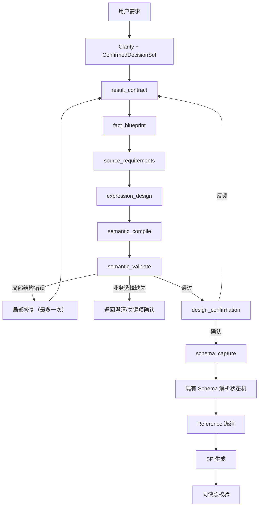

# SemanticDesign 确定性编译根因重构实施计划

日期：2026-07-26  
状态：待实施  
适用范围：V3 查询型 / 报表型 SQL Server 存储过程 Agent  
前置成果：Schema 解析状态机核心实现已完成，离线回归 `171 passed, 8 skipped`  
兼容策略：当前全部会话均为测试数据，不兼容旧 SemanticDesign 草稿和旧中断状态

## 1. 执行结论

下一阶段不再增加 SemanticDesign 大 Prompt 的示例、字段名规则或完整 JSON 重试。
必须把 SemanticDesign 从“LLM 一次性生成的大型对象”改造成“多个小型业务契约经过
确定性编译得到的最终制品”。

当前链路的实际问题是：

```text
用户确认的业务决策
→ LLM 一次生成实体、源字段、事实、维度、指标、关联、粒度、公式和输出绑定
→ 任意局部引用错误导致整个 SemanticDesign 失败
→ LLM 用另一份完整 JSON 修复
→ 正确部分也可能被随机改坏
```

第三次真实 E2E 的错误：

```text
grain 引用了未声明输出 matched_trans_id
```

不是 `matched_trans_id` 这个名字需要特殊处理，而是当前系统错误地允许 LLM 同时
创建“输出定义”和“对输出的跨字段引用”。最终引用完整性应当由程序建立，模型只能
表达业务选择。

目标链路：

```text
ConfirmedDecisionSet
→ ResultContract
→ FactBlueprint
→ SourceRequirements
→ ExpressionDesign
→ SemanticCompiler
→ SemanticContract
→ 用户确认业务方案
→ 现有 Schema 状态机
→ Reference 冻结
→ SP 生成
→ 同快照校验
```

## 2. 成功标准

本阶段必须提供以下稳定路径：

```text
自然语言需求
→ 小型业务契约逐步形成
→ 程序生成全部稳定 ID 和引用
→ SemanticContract 确定性编译通过
→ 用户确认
→ Schema 正确冻结
→ Reference 正确冻结
→ SP 正确生成
→ 真实结果一致
→ validated
```

“实施完成”必须同时满足：

- LLM 不再直接输出最终 SemanticDesign。
- LLM 不再自由创建跨模块引用 ID。
- grain 只能由编译器从已存在输出建立。
- 派生维度必须有结构化表达式，不能只写在 meaning 中。
- 每个结果输出恰好有一个可推导类型的公式。
- 多事实关联由编译器检查连通性和键类型。
- 局部修复不能覆盖已冻结的正确阶段。
- 设计失败时 Schema、Reference 和 SP 均不得运行。
- 两个自然语言主 E2E 各连续通过 3 次。

## 3. 范围与非目标

### 3.1 本轮范围

- 新增 ResultContract、FactBlueprint、SourceRequirements、
  ExpressionDesign 四类中间契约。
- 新增确定性 SemanticCompiler。
- 新增稳定 ID 注册表和符号解析器。
- 新增表达式类型推导与引用完整性检查。
- 拆分现有 SemanticDesign Prompt。
- 增加设计阶段 checkpoint 和下游失效传播。
- 重构 Agent 设计状态机。
- 更新设计错误的后端协议、SSE 和 UI。
- 删除主链中“一次生成完整 SemanticDesign”的入口。
- 重新接入现有 Schema 解析状态机。

### 3.2 明确不做

- 不为 `matched_trans_id` 增加名字修正规则。
- 不根据 SAP 表名或字段名修改业务设计。
- 不让 LLM 生成 SQL、SchemaBinding 或 Reference。
- 不修改现有 Reference 优先、SP 隔离生成和最终比较原则。
- 不增加无限设计重试。
- 不兼容旧设计 checkpoint。
- 不扩展到写入型、多结果集、动态 SQL 或游标存储过程。

## 4. 不可破坏的不变量

1. ConfirmedDecisionSet 是用户业务选择事实源。
2. ResultContract 是最终结果形状和业务口径事实源。
3. FactBlueprint 只表达独立业务事实，不表达物理表和字段。
4. SourceRequirements 只表达底层业务字段，不表达派生指标。
5. ExpressionDesign 只引用已注册符号，不自由创建符号。
6. SemanticContract 只能由 SemanticCompiler 产生。
7. SemanticCompiler 不调用 LLM。
8. 所有稳定 ID 由程序生成，不采用模型返回的 ID。
9. 任何上游 hash 变化都会使对应下游制品失效。
10. SemanticContract 未通过时不得进入 Schema。
11. SchemaBinding 未冻结时不得进入 Reference。
12. Reference 未冻结时不得进入 SP。
13. 任一 gate 未通过时部署资格必须为 false。

## 5. 目标架构



局部修复不能统一返回 `result_contract`。应根据错误归属返回对应节点：

| 错误阶段 | 返回节点 |
|---|---|
| 输出、参数、粒度口径 | result_contract |
| 事实拆分、事实粒度 | fact_blueprint |
| 实体、底层字段需求 | source_requirements |
| 派生维度、指标、最终公式 | expression_design |
| 编译器内部错误 | 直接停止 |

## 6. 中间契约

建议新增 `app/contracts/semantic_design.py`，现有
`app/contracts/semantic.py` 只保留最终 SemanticContract。

### 6.1 ResultContract

职责：冻结用户最终想得到什么，不描述数据如何取得。

```python
class ResultParameterSpec(StrictContract):
    symbol: str
    name: str
    logical_type: LogicalType
    required: bool
    default: Any | None
    meaning: str
    boundary: Boundary


class ResultOutputSpec(StrictContract):
    symbol: str
    name: str
    meaning: str
    logical_type: LogicalType
    nullable: bool


class ResultContract(StrictContract):
    version: Literal[1]
    procedure_name: str
    purpose: str
    result_mode: ResultMode
    parameters: list[ResultParameterSpec]
    outputs: list[ResultOutputSpec]
    grain_output_symbols: list[str]
    allow_empty: bool
    money_tolerance: float
    business_policies: dict[str, str]
```

注意：

- `symbol` 是阶段内局部符号，不是最终 Semantic ID。
- 模型只能从 `outputs[].symbol` 中选择 grain。
- Pydantic 立即检查 grain 引用是否存在。
- 编译器后续把 symbol 转成稳定 ID。
- ResultContract 不包含 entity、fact、source field 或 expression。

确定性检查：

- 参数名和输出名唯一；
- 输出 symbol 唯一；
- 非 scalar 结果必须声明 grain；
- grain 必须引用已声明输出；
- money 输出必须有金额和币种政策；
- exception_rows 必须说明异常选择含义；
- 参数边界与类型相容；
- 用户确认的决策必须全部被消费。

### 6.2 FactBlueprint

职责：确定哪些独立业务事实可以证明最终结果。

```python
class FactDimensionNeed(StrictContract):
    symbol: str
    meaning: str
    result_output_symbol: str | None


class FactMeasureNeed(StrictContract):
    symbol: str
    meaning: str
    logical_type: LogicalType
    aggregation: Aggregation


class FactBlueprintItem(StrictContract):
    symbol: str
    meaning: str
    entity_symbols: list[str]
    dimensions: list[FactDimensionNeed]
    measures: list[FactMeasureNeed]
    grain_dimension_symbols: list[str]
    filter_policy_keys: list[str]


class FactJoinBlueprint(StrictContract):
    left_fact_symbol: str
    right_fact_symbol: str
    left_dimension_symbol: str
    right_dimension_symbol: str
    join_type: Literal["inner", "left", "full"]
    meaning: str


class FactBlueprint(StrictContract):
    facts: list[FactBlueprintItem]
    joins: list[FactJoinBlueprint]
```

确定性检查：

- final_result、sp_result 等伪事实名称拒绝；
- 每个事实必须有维度或指标；
- grain 引用本事实维度；
- join 只能引用已声明事实和维度；
- 多事实 join 图必须连通；
- left join 方向必须可确定；
- 每个最终输出能追溯到至少一个事实或最终公式。

### 6.3 SourceRequirements

职责：表达实现事实需要哪些单粒度业务实体和底层业务字段。

```python
class EntityRequirement(StrictContract):
    symbol: str
    meaning: str
    grain_meaning: str


class SourceFieldRequirement(StrictContract):
    symbol: str
    entity_symbol: str
    meaning: str
    logical_type: LogicalType
    nullable: bool


class SourceRequirements(StrictContract):
    entities: list[EntityRequirement]
    fields: list[SourceFieldRequirement]
    fact_entity_usage: dict[str, list[str]]
```

确定性检查：

- 每个 entity 只能有一个业务粒度；
- 单据头、单据行、凭证头、分录、科目必须拆分；
- 每个 source field 归属一个 entity；
- fact 使用的字段所属实体必须包含在 fact_entity_usage；
- 派生词汇不能作为直接源字段；
- 未被事实、过滤或表达式消费的字段拒绝；
- 业务展示编号与内部关联标识不能复用同一个 symbol。

“派生词汇不能作为直接源字段”不能只靠关键词。ExpressionDesign 完成后，编译器
必须验证每个直接源字段都只被当作叶子引用；任何由多个输入构成的业务值必须是
expression。

### 6.4 ExpressionDesign

职责：定义事实维度、事实指标、最终结果绑定和异常过滤。

模型不能写自由 ID，只能引用前三阶段已经存在的 symbol。

```python
class SymbolExpression(StrictContract):
    kind: Literal[
        "source", "fact_value", "output", "parameter", "literal",
        "binary", "unary", "function", "case",
    ]
    symbol: str | None
    operator: str | None
    value: Any | None
    args: list["SymbolExpression"]
    cases: list["SymbolWhenThen"]
    else_expr: "SymbolExpression | None"


class FactDimensionExpression(StrictContract):
    fact_symbol: str
    dimension_symbol: str
    expression: SymbolExpression
    logical_type: LogicalType


class FactMeasureExpression(StrictContract):
    fact_symbol: str
    measure_symbol: str
    expression: SymbolExpression | None
    source_symbol: str | None
    aggregation: Aggregation
    logical_type: LogicalType


class ResultBindingExpression(StrictContract):
    output_symbol: str
    expression: SymbolExpression


class ExpressionDesign(StrictContract):
    dimensions: list[FactDimensionExpression]
    measures: list[FactMeasureExpression]
    results: list[ResultBindingExpression]
    result_filter: SymbolExpression | None
```

确定性检查：

- 每个事实维度恰好实现一次；
- 每个事实指标恰好实现一次；
- 每个结果输出恰好绑定一次；
- `source` 只能引用 SourceRequirements；
- `fact_value` 只能引用 FactBlueprint；
- `output` 只能引用 ResultContract；
- output 依赖无循环；
- 派生维度必须有 expression 和 logical_type；
- 直接维度可以编译成 source expression；
- `count_rows` 不允许 source/expression；
- 其他指标必须且只能有 source 或 expression；
- exception_rows 必须有 result_filter；
- full_rows/scalar_summary 不得偷偷增加异常过滤。

## 7. 稳定 ID 与符号表

新增 `app/services/semantic_symbols.py`。

### 7.1 稳定 ID 生成

最终 ID 由以下内容生成：

```text
normalize(business symbol)
+ namespace
+ owner symbol
```

例如：

```text
output:document_number
entity:sales_invoice_header
source:sales_invoice_header:posting_date
fact:sales_revenue
fact_dimension:sales_revenue:period
fact_measure:sales_revenue:amount
```

编译器生成满足现有正则的 snake_case ID。冲突时采用确定性的语义后缀，不使用随机
数字，也不让 LLM重命名。

### 7.2 SymbolTable

```python
class SemanticSymbolTable:
    parameters: dict[str, str]
    outputs: dict[str, str]
    entities: dict[str, str]
    source_fields: dict[str, str]
    facts: dict[str, str]
    fact_values: dict[tuple[str, str], tuple[str, str]]
```

职责：

- 注册阶段符号；
- 检查重复和命名空间冲突；
- 把 SymbolExpression 编译成现有 SemanticExpression；
- 产生 source map，便于错误展示；
- 不进行业务猜测。

## 8. SemanticCompiler

新增 `app/services/semantic_compiler_v3.py`。

建议接口：

```python
def compile_semantic_contract(
    result_contract: ResultContract,
    fact_blueprint: FactBlueprint,
    source_requirements: SourceRequirements,
    expression_design: ExpressionDesign,
    confirmed_decisions: ConfirmedDecisionSet,
) -> SemanticCompileResult:
    ...
```

返回：

```python
class SemanticCompileResult(StrictContract):
    contract: SemanticContract
    symbol_table: dict
    source_map: dict
    consumed_decision_keys: list[str]
    diagnostics: list[SemanticDiagnostic]
```

### 8.1 编译顺序

1. 注册参数和输出；
2. 编译 grain；
3. 注册实体；
4. 注册源字段；
5. 注册 facts；
6. 编译事实维度；
7. 编译事实指标；
8. 编译事实过滤；
9. 编译 fact joins；
10. 编译 result bindings；
11. 编译 result filter；
12. 推导所有表达式类型；
13. 验证输出依赖；
14. 验证事实图；
15. 验证业务决策消费；
16. 构造并再次验证 SemanticContract；
17. 生成 canonical JSON 和 hash。

### 8.2 类型推导

类型推导必须由程序完成，至少支持：

- source、fact_value、output、parameter；
- literal；
- 数值四则运算；
- 比较和逻辑运算；
- ABS、COALESCE、NULLIF；
- CONCAT、YEAR、MONTH；
- CASE；
- NULL 传播；
- money/decimal 兼容；
- date/datetime 兼容边界；
- boolean result filter。

错误示例：

```text
SEMANTIC_RESULT_TYPE_MISMATCH
output=Period
expected=string
actual=date
source=fact:sales_revenue.dimension:period
```

不能等到 Reference SQL 编译才发现。

### 8.3 决策消费

ConfirmedDecisionSet 中影响结果的每个决策必须被某个中间契约消费。

例如：

| 决策 | 必须落点 |
|---|---|
| currency_basis | ResultContract.business_policies + money source meanings |
| revenue_amount_basis | SourceRequirements / measure expression |
| journal_sign_basis | FactMeasureExpression |
| cancellation_reversal_policy | filters / fact scope |
| comparison_granularity | ResultContract.grain + FactBlueprint |
| tolerance | ResultContract.money_tolerance + result formula |

遗漏决策时返回设计阶段，不允许使用默认猜测继续。

## 9. 设计状态 checkpoint

新增 `app/contracts/semantic_design_state.py` 和 SQLite 表：

```sql
CREATE TABLE semantic_design_checkpoints_v3 (
    id TEXT PRIMARY KEY,
    session_id TEXT NOT NULL,
    decision_hash TEXT NOT NULL,
    stage TEXT NOT NULL,
    stage_input_hash TEXT NOT NULL,
    result_contract_json TEXT,
    fact_blueprint_json TEXT,
    source_requirements_json TEXT,
    expression_design_json TEXT,
    compile_result_json TEXT,
    diagnostics_json TEXT NOT NULL,
    repair_counts_json TEXT NOT NULL,
    status TEXT NOT NULL,
    created_at TIMESTAMP DEFAULT CURRENT_TIMESTAMP,
    updated_at TIMESTAMP DEFAULT CURRENT_TIMESTAMP,
    UNIQUE(session_id)
);
```

状态：

```text
building_result
building_facts
building_sources
building_expressions
compiling
ready_for_confirmation
confirmed
failed
invalidated
```

失效规则：

- decision_hash 变化：全部失效；
- ResultContract 变化：facts/sources/expressions/compile 全部失效；
- FactBlueprint 变化：sources/expressions/compile 失效；
- SourceRequirements 变化：expressions/compile 失效；
- ExpressionDesign 变化：compile 失效；
- 仅 UI 展示文字变化：不使业务制品失效。

每阶段 `repair_count <= 1`。同一阶段第二次仍无法形成有效契约，立即停止，不进入
下一阶段。

## 10. Prompt 拆分

修改 `app/agent/prompts.py`，新增四个 Prompt。

### 10.1 RESULT_CONTRACT_PROMPT

输入：

- 用户需求；
- ConfirmedDecisionSet；
- ResultContract JSON Schema。

输出：

- ResultContractDraft。

禁止：

- entity；
- source field；
- fact；
- SQL；
- 物理名称。

### 10.2 FACT_BLUEPRINT_PROMPT

输入：

- 冻结 ResultContract；
- ConfirmedDecisionSet；
- FactBlueprint JSON Schema。

输出：

- FactBlueprintDraft。

禁止修改 ResultContract。

### 10.3 SOURCE_REQUIREMENTS_PROMPT

输入：

- ResultContract；
- FactBlueprint；
- ConfirmedDecisionSet；
- SourceRequirements JSON Schema。

输出：

- SourceRequirementsDraft。

禁止：

- 物理表列；
- 最终公式；
- 修改输出。

### 10.4 EXPRESSION_DESIGN_PROMPT

输入：

- 前三个冻结契约；
- 可用符号表；
- 允许的函数和运算符；
- ExpressionDesign JSON Schema。

输出：

- ExpressionDesignDraft。

Prompt 中必须直接提供“允许引用的 symbol 清单”，模型不得自由创建 symbol。

### 10.5 局部修复 Prompt

每阶段使用独立修复 Prompt，只包含：

- 当前阶段输入；
- 上一次当前阶段输出；
- 当前阶段 diagnostics；
- 当前阶段 JSON Schema；
- 冻结上游 hash。

不得包含或要求重写其他阶段输出。

## 11. Agent 图重构

当前：

```text
clarify
→ assumptions
→ plan/design
→ schema_capture
```

目标：

```text
clarify
→ assumptions
→ result_contract
→ fact_blueprint
→ source_requirements
→ expression_design
→ semantic_compile
→ design_confirmation
→ schema_capture
```

新增节点：

- `result_contract_node`
- `fact_blueprint_node`
- `source_requirements_node`
- `expression_design_node`
- `semantic_compile_node`

保留但缩小：

- `design_node` 只负责向用户展示已编译 SemanticContract 和处理反馈；
- 不再负责生成完整 SemanticDesign。

删除主链行为：

- `_build_semantic_design_v3` 一次性完整生成；
- 完整 SemanticDesign 修复 Prompt；
- LLM自由生成 contract_id、entity_id、source_field_id、fact_id 和 grain ID；
- 设计失败后覆盖整份 draft。

## 12. 用户确认与反馈

### 12.1 用户确认内容

用户看到：

- 存储过程用途；
- 参数；
- 结果模式；
- 输出；
- 业务粒度；
- 事实来源；
- 金额/币种/日期/取消冲销政策；
- 最终公式；
- 已确认业务假设。

用户不需要看到：

- 内部 symbol table；
- hash；
- Pydantic JSON；
- 稳定 ID；
- 编译器 source map。

### 12.2 用户反馈路由

反馈先分类：

| 反馈内容 | 最早失效阶段 |
|---|---|
| 修改输出、参数、粒度 | ResultContract |
| 修改事实来源/拆分 | FactBlueprint |
| 修改所需底层业务字段 | SourceRequirements |
| 修改公式、借贷方向、派生维度 | ExpressionDesign |

分类可以由 LLM提出，但程序根据受影响的结构化字段执行失效，不能让 LLM直接覆盖
checkpoint。

## 13. 错误协议与 UI

统一错误结构：

```json
{
  "stage": "semantic_compile",
  "code": "SEMANTIC_GRAIN_OUTPUT_MISSING",
  "category": "contract_reference",
  "business_element": "matched_trans_id",
  "summary": "业务粒度没有对应的结果输出",
  "evidence": {
    "available_outputs": []
  },
  "system_action": "已停止 SemanticContract 编译，尚未访问 Schema",
  "user_action": "无需操作，系统只重建结果粒度阶段",
  "retryable": true
}
```

错误类别：

- `decision_missing`
- `contract_shape`
- `contract_reference`
- `expression_type`
- `fact_graph`
- `internal_compiler`
- `environment`

主要错误码：

```text
RESULT_OUTPUT_DUPLICATE
RESULT_GRAIN_REQUIRED
RESULT_GRAIN_OUTPUT_MISSING
FACT_PSEUDO_SOURCE_REJECTED
FACT_GRAIN_DIMENSION_MISSING
FACT_JOIN_SYMBOL_UNKNOWN
FACT_JOIN_GRAPH_DISCONNECTED
SOURCE_ENTITY_GRAIN_MIXED
SOURCE_FIELD_OWNER_UNKNOWN
SOURCE_FIELD_UNUSED
EXPRESSION_SYMBOL_UNKNOWN
EXPRESSION_TYPE_MISMATCH
RESULT_BINDING_MISSING
RESULT_BINDING_DUPLICATE
RESULT_DEPENDENCY_CYCLE
DECISION_NOT_CONSUMED
SEMANTIC_COMPILER_INTERNAL_ERROR
```

UI 必须展示：

- 当前阶段；
- 业务对象；
- 系统为什么停止；
- 系统只会重做哪一小段；
- 用户是否需要操作；
- Schema/SQL 是否已经开始。

设计阶段错误不能显示“自动修复 SQL”。

## 14. 代码改动清单

### 14.1 新增

- `app/contracts/semantic_design.py`
- `app/contracts/semantic_design_state.py`
- `app/services/semantic_symbols.py`
- `app/services/semantic_compiler_v3.py`
- `app/services/semantic_type_inference.py`
- `app/services/semantic_design_pipeline.py`
- `test_result_contract_v3.py`
- `test_fact_blueprint_v3.py`
- `test_source_requirements_v3.py`
- `test_expression_design_v3.py`
- `test_semantic_symbols_v3.py`
- `test_semantic_compiler_v3.py`
- `test_semantic_design_persistence_v3.py`
- `test_semantic_design_graph_v3.py`

### 14.2 修改

- `app/contracts/semantic.py`
  - 保留最终 SemanticContract；
  - 抽出可复用表达式类型；
  - 禁止外部主链直接构造最终合同。
- `app/agent/nodes.py`
  - 拆分设计节点；
  - 删除主链完整 JSON 生成和整份修复；
  - 接入中间 checkpoint。
- `app/agent/graph.py`
  - 接入五个新节点；
  - `design_confirmation` 后才进入 `schema_capture`。
- `app/agent/prompts.py`
  - 拆分四个 Prompt 和四个局部修复 Prompt。
- `app/db/sqlite.py`
  - 新增 semantic design checkpoint 表及事务 API。
- `app/routes/chat.py`
  - 输出结构化设计阶段错误；
  - 支持刷新后恢复设计进度。
- `app/templates/index.html`
  - 分阶段进度和错误卡片；
  - 设计确认展示编译后的业务摘要。
- `app/static/style.css`
  - 设计阶段状态和错误卡片样式。
- `scripts/run_sales_journal_user_e2e_guarded.py`
  - 输出每个设计阶段；
  - 保留真实歧义不猜测规则。
- `scripts/resume_confirmed_design_e2e_guarded.py`
  - 支持从语义设计 checkpoint 或 Schema checkpoint 恢复。

### 14.3 删除或停用

- 主链一次性生成完整 SemanticDesign 的函数；
- 完整 SemanticDesign 二次覆盖式修复；
- 异常字符串决定设计重试阶段；
- LLM生成跨模块 ID；
- 用户确认前才发现 grain/output/fact 引用错误的路径；
- 设计失败后继续 Schema 的路径。

## 15. 分阶段实施

### 阶段 0：锁定基线

工作：

- 保存当前 `171 passed, 8 skipped` 基线；
- 为第三次 E2E 的虚构 grain 建立必失败测试；
- 为 date fact value 绑定 string output 建立必失败测试；
- 保存现有成功 Schema checkpoint 测试。

验证：

- 新增测试在旧设计生成架构上失败；
- 失败发生在设计阶段，不依赖真实 LLM 或数据库。

### 阶段 1：ResultContract

工作：

- 实现契约和确定性校验；
- 实现 ConfirmedDecisionSet 消费映射的第一部分；
- 实现 ResultContract Prompt。

测试：

- grain 引用不存在输出时失败；
- 重复输出失败；
- 明细无 grain 失败；
- scalar 可无 grain；
- 参数边界错误失败；
- 金额口径缺失失败；
- 模型不能增加 entity/fact 字段；
- 局部修复不能改变已确认决策。

退出条件：

- `matched_trans_id` 类问题不能离开 ResultContract 阶段。

### 阶段 2：FactBlueprint

工作：

- 实现事实、维度需求和关联蓝图；
- 实现事实图检查；
- 实现 FactBlueprint Prompt。

测试：

- 单实体明细可无 facts；
- 汇总必须有 facts；
- 多来源按来源拆事实；
- final_result 伪事实失败；
- fact grain 引用未知维度失败；
- join 引用未知事实/维度失败；
- 多事实图不连通失败；
- left join 方向错误失败。

退出条件：

- 事实图在任何源字段或 Schema 生成之前完整有效。

### 阶段 3：SourceRequirements

工作：

- 实现单粒度实体和源字段需求；
- 实现事实实体使用检查；
- 实现 SourceRequirements Prompt。

测试：

- 头/行复合实体失败；
- 字段引用未知实体失败；
- fact 使用字段但未包含实体失败；
- 未使用源字段失败；
- 内部匹配键与展示编号不能复用；
- 不允许物理表列名污染；
- 净额/差异等派生值必须转 ExpressionDesign。

退出条件：

- Schema 层只接收真正需要物理绑定的叶子字段。

### 阶段 4：ExpressionDesign

工作：

- 实现符号表达式；
- 实现维度、指标、结果公式和异常过滤；
- 实现符号白名单 Prompt。

测试：

- 未知 symbol 失败；
- 派生年月必须有 expression；
- direct date 不能绑定 string period；
- 贷方减借方表达式正确推导 money；
- 每个输出恰好一个绑定；
- 输出依赖循环失败；
- exception_rows 无 result_filter 失败；
- count_rows 带字段或表达式失败。

退出条件：

- 所有公式在 SemanticCompiler 前已经结构化且可推导。

### 阶段 5：SymbolTable 与 SemanticCompiler

工作：

- 实现稳定 ID；
- 实现四个中间契约到 SemanticContract 的编译；
- 实现 source map 和 diagnostics；
- 实现决策消费完整性。

测试：

- 同输入产生相同 ID 和 hash；
- 输入顺序不影响稳定 ID；
- symbol 冲突确定性失败；
- grain 只引用已注册输出；
- fact/result 引用全部解析；
- money/decimal 类型兼容；
- date/string 类型不兼容；
- 所有决策被消费；
- 最终 SemanticContract 再验证通过。

退出条件：

- 单元测试中不使用 LLM也能构造完整正确 SemanticContract。

### 阶段 6：checkpoint 持久化

工作：

- 新表和事务 API；
- 阶段 hash、repair_count、失效传播；
- 跨进程恢复。

测试：

- 每阶段保存和读取；
- 相同输入幂等；
- decision hash 变化全部失效；
- ResultContract 变化级联失效；
- 仅 ExpressionDesign 变化不重做上游；
- 陈旧写入失败；
- repair_count 超限停止；
- 多会话隔离。

退出条件：

- 服务重启后不需要重新生成已冻结的正确阶段。

### 阶段 7：Agent 图接线

工作：

- 增加五个节点；
- design_node 缩为展示和反馈；
- 删除主链完整 SemanticDesign 生成；
- 接入现有 Schema 状态机。

测试：

- happy path 按固定阶段顺序运行；
- ResultContract 失败时后续节点未调用；
- FactBlueprint 失败时 sources 未调用；
- compile 失败时 Schema 未调用；
- 用户确认后才进入 Schema；
- 用户修改输出只失效相应下游；
- 已确认设计 hash 与 Schema checkpoint 对齐。

退出条件：

- graph 中不存在 LLM直接返回最终 SemanticDesign 的主路径。

### 阶段 8：接口与 UI

工作：

- 阶段进度事件；
- 结构化错误卡片；
- checkpoint 恢复展示；
- 用户反馈影响范围展示。

测试：

- 每个错误包含 stage/code/business element/system action/user action；
- 设计错误不显示 SQL 修复；
- 刷新后恢复当前阶段；
- HTML 转义；
- assumptions、Schema choice、design revision、verify UI 不回归。

退出条件：

- 用户无需看日志即可知道正在构建哪一部分，以及失败是否需要其参与。

### 阶段 9：删除旧入口和全量回归

工作：

- 删除不可达的完整 JSON设计生成代码；
- 删除整份覆盖式修复 Prompt；
- 清理本次改动产生的孤儿代码。

验证：

```powershell
.venv\Scripts\python.exe -m pytest test_result_contract_v3.py -q
.venv\Scripts\python.exe -m pytest test_fact_blueprint_v3.py -q
.venv\Scripts\python.exe -m pytest test_source_requirements_v3.py -q
.venv\Scripts\python.exe -m pytest test_expression_design_v3.py -q
.venv\Scripts\python.exe -m pytest test_semantic_symbols_v3.py -q
.venv\Scripts\python.exe -m pytest test_semantic_compiler_v3.py -q
.venv\Scripts\python.exe -m pytest test_semantic_design_persistence_v3.py -q
.venv\Scripts\python.exe -m pytest test_semantic_design_graph_v3.py -q
.venv\Scripts\python.exe -m pytest -q
git diff --check
```

退出条件：

- 全量离线测试通过；
- 没有测试访问真实 LLM 或数据库；
- 未改动无关工作树内容。

### 阶段 10：真实数据库 E2E

仅在离线回归全部通过后执行。

用例 A：

```text
做一个查询应收发票明细的存储过程
```

用例 B：

```text
我现在要做一个销售收入统计和财务凭证比对的存储过程
```

用例 C：

```text
按月份统计销售收入，并与收入类凭证的贷方减借方净额比较
```

用例 D：

```text
查询指定日期范围内未取消的应收发票，按客户和月份汇总未税收入
```

每次检查：

- 从自然语言开始；
- 不注入人工中间契约；
- 不手工编辑 SQLite；
- 不手工修改 SemanticContract；
- 设计各阶段 hash 完整；
- SemanticCompiler 成功；
- SchemaBinding 成功；
- Reference 和 SP 在真实 SQL Server 编译；
- 合法边界、空区间和 coverage 用例执行；
- Actual/Expected 无 missing、extra、duplicate、difference；
- `deployment_eligible=true` 仅在最终校验后出现；
- Snapshot 恢复原值；
- 永久测试 SP 数量为 0。

稳定性门槛：

- 用例 A 连续 3 次通过；
- 用例 B 连续 3 次通过；
- 用例 C 连续 3 次通过；
- 用例 D 连续 3 次通过。

## 16. 测试矩阵

| 场景 | 必须停止阶段 | 预期 |
|---|---|---|
| grain 引用未声明输出 | ResultContract | `RESULT_GRAIN_OUTPUT_MISSING` |
| 两个输出同名 | ResultContract | `RESULT_OUTPUT_DUPLICATE` |
| 多来源只建 final_result | FactBlueprint | `FACT_PSEUDO_SOURCE_REJECTED` |
| fact grain 引用未知维度 | FactBlueprint | `FACT_GRAIN_DIMENSION_MISSING` |
| 头行混为一个 entity | SourceRequirements | `SOURCE_ENTITY_GRAIN_MIXED` |
| 字段归属未知实体 | SourceRequirements | `SOURCE_FIELD_OWNER_UNKNOWN` |
| 年月含义直接使用 date | ExpressionDesign | `EXPRESSION_TYPE_MISMATCH` |
| 输出未绑定 | ExpressionDesign | `RESULT_BINDING_MISSING` |
| output 循环引用 | SemanticCompiler | `RESULT_DEPENDENCY_CYCLE` |
| 决策未被消费 | SemanticCompiler | `DECISION_NOT_CONSUMED` |
| Semantic 编译失败 | 设计阶段 | Schema 不运行 |
| Schema 未冻结 | Schema 阶段 | Reference 不运行 |
| Reference 失败 | Reference 阶段 | SP 不运行 |
| 对账不一致 | verify | 不可部署 |

## 17. 停止条件

以下情况必须停止，不能继续用 Prompt 补丁消耗 token：

1. 同一中间契约连续两次无法通过其确定性校验。
2. SemanticCompiler 需要依赖自然语言猜测符号引用才能工作。
3. 为通过 E2E 需要写具体 SAP 字段名规则。
4. 为通过 E2E 需要手工修改 SQLite 或 SemanticContract。
5. 同一根因在修复后连续 3 次重新出现。
6. LLM 仍能绕过中间契约直接改变冻结业务口径。
7. 完成此重构后，四个 E2E 仍出现大量无共同结构的随机跨阶段错误。

触发停止条件时报告：

- 最早失败阶段；
- 稳定错误码；
- 输入和冻结上游 hash；
- 编译器 diagnostics；
- 是否属于契约表达能力缺失；
- 是否值得继续扩展当前通用 SP Agent。

## 18. 审查清单

代码审查必须逐项回答：

- 主链是否仍允许 LLM输出最终 SemanticDesign？
- 是否仍有 LLM自由创建的跨模块 ID？
- grain 是否完全由已存在输出编译？
- 派生维度是否必须有表达式？
- 表达式是否在设计阶段完成类型推导？
- 是否每个用户决策都有明确消费位置？
- 局部修复是否只修改当前阶段？
- checkpoint 是否能跨进程恢复？
- 上游变化是否正确失效下游？
- SemanticCompiler 是否完全确定性且不调用 LLM？
- Semantic 失败时 Schema 是否确实未调用？
- Schema、Reference、SP 的现有隔离是否保持？
- UI 是否显示正确阶段和用户动作？
- E2E 是否无需手工改合同或数据库？

## 19. 完成定义

本计划只有同时满足以下条件才算完成：

1. 四类中间契约全部落地。
2. SemanticCompiler 和稳定符号表全部落地。
3. 最终 SemanticContract 只由编译器产生。
4. 完整 SemanticDesign LLM 生成入口从主链删除。
5. 局部 checkpoint 和失效传播通过测试。
6. 设计错误信息在后端、SSE 和 UI 中一致。
7. 现有 Schema 状态机正确接入且没有被绕过。
8. 全量离线测试通过。
9. 四个自然语言 E2E 各连续 3 次通过。
10. 测试数据库 Snapshot 恢复且无永久 SP。

任何一项未满足，都不能声称 Agent 已经可以稳定生成任意查询型存储过程。
